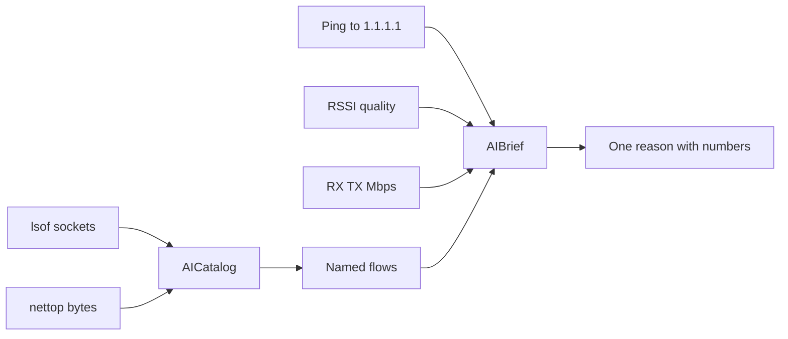

## Problem

A speed test tells you the pipe is wide. Activity Monitor tells you a process is loud. Neither tells you why the ping moved while Cursor was streaming. I run three or four LLM apps on one Mac. RSSI stays Excellent. The reflex is “Wi-Fi died.” The radio is fine. A helper is filling the uplink.

If you open the packet to prove it, you have a different product: a sniffer, a keychain story, a privacy review you will not finish.

## What I built

[DevWifiBar](https://github.com/tomymaritano/devwibar) — native Swift menu bar. No Dock. Always visible. Same cutoffs as the [`devwifi`](https://github.com/tomymaritano/devwifi) CLI.

Process name. Destination host. Interface counters. Ping. RSSI. That is the catalog. `lsof` says who holds a TCP socket. `nettop` says how many bytes moved. [`AICatalog`](https://github.com/tomymaritano/devwibar/blob/main/Sources/DevWifiCore/AICatalog.swift) matches `Cursor Helper` or `api.anthropic.com`. It does not match `evilopenai.com`. Chrome talking to `api.openai.com` is OpenAI. Chrome talking to an IP is ignored. Slack is ignored. `node` without a known host is ignored.




The [bar is not the CLI](/writing/the-bar-is-not-the-cli). Password reveal, QR share, speed test, DNS switching, device scan, alerts stay in the toolkit.

```bash
brew tap tomymaritano/tap
brew install --cask devwibar
open -a DevWifiBar
```

## One hard decision

Nothing inside TLS. No payload. No keychain. [`AIBrief.diagnose`](https://github.com/tomymaritano/devwibar/blob/main/Sources/DevWifiCore/AIBrief.swift) is a function you can test: offline, disconnected, quiet, streaming, uplink lag, saturated, live.

Latency is high above 80 ms and clears below 60 ms. Saturate above 2.5 Mbps and clears below 1.6 Mbps. If ping is high and signal is Excellent or Good, the verdict is the host — not RSSI. Three chips. One sentence with the numbers. No slogan rewrite.

The [widget is not a radar](/writing/the-widget-is-not-a-radar). WidgetKit reads a snapshot. It will not run `lsof`.
