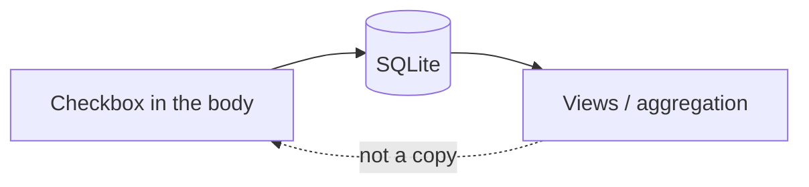

A notes app that stores todos in a table looks complete. Then checking a box is two writes, and export is missing the list. A task pane that is the source of truth looks fast. Then the Markdown is a cache of a second product.

[Dripnex](/work/dripnex) keeps the box in the file. [`@dripnex/tasks`](https://github.com/dripnex/docs-site/blob/main/content/docs/architecture/core.mdx) extracts `- [ ]` and `- [x]` from the Markdown you typed. Structured completion, views, aggregation across notes. Not a second store.

Tags are a different job — they [are not the body](/writing/tags-are-not-the-body). Wikilinks are in the body, and [the graph is derived](/writing/a-backlink-is-not-a-copy). A checkbox is the same cut as the link: the characters are canonical.

## The problem

If tasks are rows, a rename of the heading is unrelated to the todo, and export is a document without the work. If completion lives in a column, toggling the box in the editor is a lie unless you rewrite both. If you invent a vendor task format, other tools cannot open the list.

The note entity is a raw `content` string plus derived metadata. `@dripnex/tasks` parses that string. Domain operations stay in `@dripnex/core` — no Electron, no React. Storage implements a repository. The task pane is a read of the Markdown, not a write of a second table.

Checking a box rewrites the characters you typed. That is honest. A `completed_at` next to a stale `- [ ]` is two truths.

## One hard decision

**A checkbox is not a row.** `- [ ]` is Markdown. Aggregation is derived. Do not persist a second list that can disagree with the file.

A pane you can throw away is honest. A todos table that claims to be the note is a different product.

## What I would not do again

Store tasks as rows so the sidebar can filter "open." Then export is missing the work, and the editor is a cache.

Invent a proprietary checkbox so "it's a real GTD app." Then another editor cannot open the list.

## The bar

A `- [x]` another editor can still read, and a task view that can be recomputed. Internals: [core](https://github.com/dripnex/docs-site/blob/main/content/docs/architecture/core.mdx). Live at [dripnex.app](https://dripnex.app).
