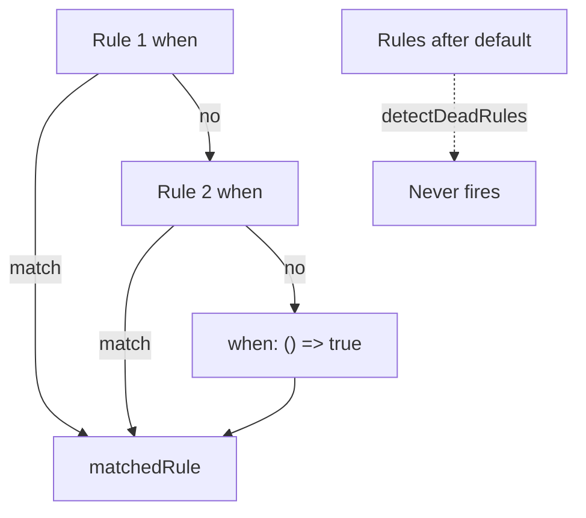

A coverage report that scores every `when` looks fair. Then *why* is a ranking, and a rule after `() => true` still shows zero hits like it failed. A fuzz that never reaches the last id looks broken. Then first match already won, and the last id was never a candidate.

[Criterion](/work/criterionx) keeps the default a terminator. [`@criterionx/testing`](https://github.com/tomymaritano/criterionx/blob/main/packages/testing/README.md) is the contract: `detectDeadRules` returns the ids after a catch-all. **A dead rule is not a ranking.** `coverage()` runs `engine.run` and counts `matchedRule`. Hits on later rules would be a second product.

Which rule fires is [first match](/writing/first-match-wins). What *why* is is written [elsewhere](/writing/if-you-cannot-show-why). This is how you test the list without turning it into a score.

## The problem

If uncovered rules fail the suite, the default is a bug. If you rank `when` by how often it almost matched, the audit trail is a table. If dead code is a SAT problem, the test package is a second engine.

[`detectDeadRules`](https://github.com/tomymaritano/criterionx/blob/main/packages/testing/src/coverage.ts) walks the list. It stringifies `when`. If the body is `=> true`, `return true`, or `()=>true`, everything after is dead. It does not solve the function. It names the terminator.

`coverage()` constructs an `Engine`, runs each case, increments `result.meta.matchedRule`. `formatCoverageReport` prints hits. `meetsCoverageThreshold` is a number — eighty percent in the README example — not a reason. `testDecision` asserts `status` and `ruleId`. `fuzz` and `checkProperty` re-export fast-check. The package depends on `@criterionx/core`. The squiggle in the editor is [not this](/writing/the-editor-is-not-the-engine).

`expect.noUnreachableRules` fails the suite when a rule never ran. That is coverage of the path you meant. It is not a ranking of the ones that lost.

## One hard decision

**A dead rule is not a ranking.** `detectDeadRules`. After `when: () => true`, later ids never fire. Do not score the misses. Do not treat zero hits after the default as a failed `when`.

If a later rule can still win, it is not this engine.

## What I would not do again

Fail the build because the last id has zero hits. Then the default is an incident, and first match is a ranking.

Prove unreachability by executing every `when` against a solver. Then the test package owns the cut, and the list is a second product.

## The bar

A list where the default is last, and a test that names the dead ids instead of ranking them. Package: [packages/testing](https://github.com/tomymaritano/criterionx/tree/main/packages/testing). Docs: [tomymaritano.github.io/criterionx](https://tomymaritano.github.io/criterionx/). Core: [github.com/tomymaritano/criterionx](https://github.com/tomymaritano/criterionx).
