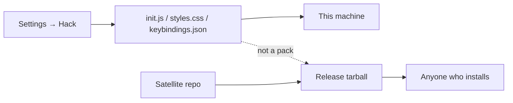

A plugin folder for personal CSS looks faster than a second surface. Then `init.js` waits on a release, and a date stamp is a product. Then you built a store for your own keybindings.

[Dripnex](/work/dripnex) keeps two worlds. **Settings → Hack** opens three files in the data directory: `init.js`, `styles.css`, `keybindings.json`. Written on first launch if missing. Existing files are not overwritten. Save to apply. Reload after changing `init.js`.

A satellite pack is a different object: a git repo plus a GitHub Release tarball. That decision is written [elsewhere](/writing/the-plugin-is-a-git-repo). This is the personal side of the cut.

## The problem

If the only way to map `jj` to escape is a pack, you will ship a pack for a chord. If the only way to enlarge the editor is a theme, you will publish a palette so you can read. Personal chrome is not a distribution problem.

`init.js` is wrapped as plugin `user-init` and runs with a `dripnex` argument. There is no Atom-style global. `dripnex.store` is a read-only snapshot — no `dispatch`. Mutate through commands, the editor, or `data`. The visible list in the window is not the whole library.

The default template leads with `registerAiCommand`: **Make this sendable**. Messy notes become a document a person would send — not a model dump. A palette command that inserts a date is a comment. It does not lead.

`styles.css` is raw CSS for you. A [theme pack](https://github.com/dripnex/theme-parchment) is a satellite anyone can install. Core ships no named palettes (`OFFICIAL_THEMES` is `[]`). Personal CSS is not a pack.

## One hard decision

**A hack is not a pack.** Settings → Hack is the personal surface. A tarball is how you share. Do not wait on a desktop release to change your own font.

Vim is not built-in. It is [dripnex/plugin-vim](https://github.com/dripnex/plugin-vim). Install it, then `dripnex.vim` exists so `init.js` can map keys. The pack is the satellite. The map is the hack.

## What I would not do again

Put personal CSS in a theme repo because "that's how themes work." Then a font-size is a version.

Treat `init.js` as a plugin you publish. Then your chords become someone else's install.

## The bar

A file you can edit without a release, and a pack you can ship without copying that file. Init: [developers.dripnex.app](https://developers.dripnex.app/getting-started/init-file). Live at [dripnex.app](https://dripnex.app).
