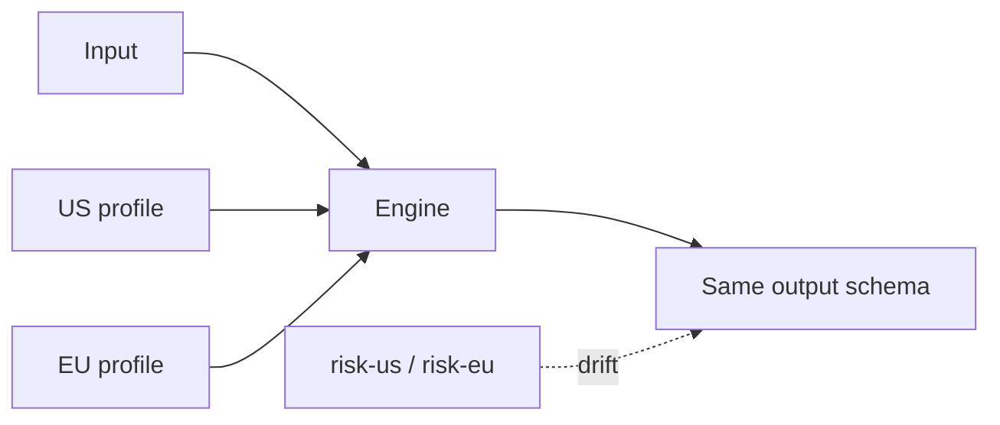

A risk rule per region looks honest. Then you have `transaction-risk-us` and `transaction-risk-eu`, and they drift on everything except the number you meant to change. A `if (region === "EU")` inside the rule looks smaller. Then the function is two products and `explain()` names a branch, not a threshold.

[Criterion](/work/criterionx) keeps one decision. The [README](https://github.com/tomymaritano/criterionx/blob/main/README.md) is the contract: profiles parameterize without changing the logic. Same function. `engine.run(decision, input, { profile: usProfile })`. Then the EU profile.

What *why* is — the audit trail — is written [elsewhere](/writing/if-you-cannot-show-why). Which rule fires is [first match](/writing/first-match-wins). This is how the number moves.

## The problem

If you fork the function for a market, every fix lands twice. If the region is an `if` in `when`, the explanation is a country, not a threshold. If the profile can change the *shape* of the output, it is not a profile. It is a different decision.

`defineDecision` takes `profileSchema` next to input and output. Zod on all three. The high-risk example is a number: `profile.threshold`. The React binding passes the map at the provider — `profiles={{ "transaction-risk": { threshold: 10000 } }}` — not a second engine.

Region, tier, environment. The rule does not change. The threshold does.

## One hard decision

**A profile is not a fork.** Same function. US and EU change the threshold, not the rule. Do not copy the file. Do not hide a market in `when`.

If the output schema would change, it is a new decision. If only the number would change, it is a profile.

## What I would not do again

Ship `decision.us.ts` and `decision.eu.ts` because "legal asked for a copy." Then the copy is where the bug lives.

Read `process.env` inside `when` so the profile is "just config." Then the core has I/O, and the test is a lie.

## The bar

One function you can test twice with two objects, and an explanation that still names the threshold. Docs: [tomymaritano.github.io/criterionx](https://tomymaritano.github.io/criterionx/). Core: [github.com/tomymaritano/criterionx](https://github.com/tomymaritano/criterionx).
