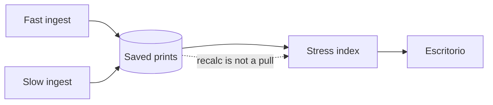

A macro site that redraws the index on every page load looks live. It is also a lie: you hit the sources twice, or you invent a number while they are quiet. A status page with a 30-day green bar looks healthy. It is also a lie if the bar is not the ingest.

[DolarGaucho](/work/dolargaucho) is the week's desk. How the strip *looks* is a different decision, written [elsewhere](/writing/the-quote-is-not-the-product). This is how the week is actually modeled. Public, on [Metodología](https://www.dolargaucho.com/about). Not financial advice.

## The problem

If every driver is a chart, there is no week — only a wall. If the index is a mystery score, nobody can check it. If a refresh is treated as a new pull, you pay the sources for work that already happened.

The [index](https://www.dolargaucho.com/about) is 0–100. Five public weights: EMBI+ 30%, FX gap 25%, IPC 20%, gross reserves 15%, blue 10%. Each contributes by how far it sits from its own history. The word on the desk — Estable — is that number, not a slogan.

Signals are automatic from public thresholds: an EMBI jump, a gap that compresses, reserves that fall, blue vol, IPC that accelerates, BADLAR, VIX / DXY / Selic around the edge. Severity, confidence, a sentence. Not forty series.

Fast sources (DolarAPI, ArgentinaDatos, Yahoo) every two hours. Slow sources (BCRA, FRED, datos.gob.ar, regional banks, CIF-UTDT) every eight hours UTC. Monthly prints stay on the last known value until the source publishes. The desk recomputes the index from **what is already saved**, or shows a recent copy.

[Status](https://www.dolargaucho.com/status) is the last ingest. Not a bar of thirty invented days.

## One hard decision

**A recalc is not a new ingest.** The week is five named drivers with public weights. A series published by someone else stays theirs.

Do not hide the recipe. Do not pretend a redraw fetched BCRA. Do not paint uptime you did not measure.

## What I would not do again

Re-hit every API because the index component mounted. The print is in the store. The index is a function of the store.

Ship a 30-day status bar because dashboards have one. Status is whether the last pull landed.

## The bar

A week you can recompute without bothering the source, and a status page that only claims the last ingest. [dolargaucho.com/about](https://www.dolargaucho.com/about) · [status](https://www.dolargaucho.com/status).
