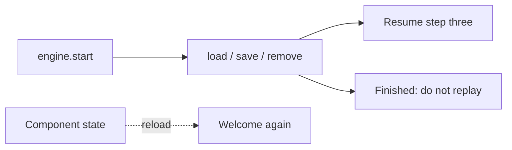

A tour that lives in the component looks simple. Then a reload is a restart, and a finished user sees welcome again. A `localStorage` snippet in the popover looks enough. Then a second tab, a second user, and a design-system rewrite each invent their own key.

[Cairn](/work/cairn) keeps progress in the engine. The [README](https://github.com/tomymaritano/cairn/blob/main/README.md) is the contract: point the engine at any key-value store and it resumes where they left off — and will not re-show a flow they already finished.

What owns the UI is a different decision, written [elsewhere](/writing/engine-is-not-the-renderer). This is the session.

## The problem

If progress is React state, a refresh is amnesia. If the tooltip writes `localStorage`, the key is a leak and a second user on the same browser is a collision. If "finished" is not stored, onboarding is a loop.

`createWebStorageAdapter()` is `localStorage` by default. Pass `namespace: currentUser.id` if the machine has more than one person. Bring your own store with three methods: `load`, `save`, `remove`. `engine.start()` resumes saved progress or starts fresh. `engine.reset()` clears it and replays from the top. Persist never mid-flight — a [run is not a click](/writing/a-run-is-not-a-click).

Onboarding spans sessions. That is not a patch on the popover. It is the engine's job.

## One hard decision

**A reload is not a restart.** Persistence is a three-method adapter on the engine. Finished must not replay. Step three must still be step three after a refresh.

A snippet in the tour component is a different product. It will disagree with the next tooltip library you try.

## What I would not do again

Keep the current step in the overlay so "it's just UI." Then a route change is a new user.

Skip a namespace because "it's a demo." Then two accounts share a welcome, and one of them is a lie.

## The bar

A flow you can close and reopen on the same waypoint, and a finished flag the engine will honor. Docs and demo: [react-cairn.vercel.app](https://react-cairn.vercel.app). Core: [github.com/tomymaritano/cairn](https://github.com/tomymaritano/cairn).
