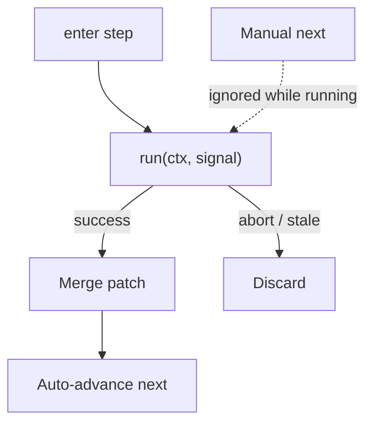

A Next button that fires the fetch looks complete. Then the user double-clicks, two requests settle, and step five is a race. A popover that `await`s in `onNext` looks honest. Then a route change unmounts the overlay, the promise still writes context, and the engine is a lie.

[Cairn](/work/cairn) keeps the action on the waypoint. The [`run`](https://github.com/tomymaritano/cairn/blob/main/packages/core/src/types.ts) field is the contract: an async function on the step, `AbortSignal` if the flow leaves mid-flight. **A run is not a click.** On success the patch merges and the engine auto-advances. Manual `next()` is ignored while `running`.

What owns the UI is written [elsewhere](/writing/engine-is-not-the-renderer). An [index is not a path](/writing/an-index-is-not-a-path). A reload is [not a restart](/writing/a-reload-is-not-a-restart). This is how a fetch is allowed to move the trail.

## The problem

If the overlay owns the request, skip is a hole and back is a second call. If `next()` can fire during `run`, two settlements write two patches. If you persist mid-flight, a reload resumes a half-finished action.

[`startRun`](https://github.com/tomymaritano/cairn/blob/main/packages/core/src/engine.ts) bumps a generation token, starts an `AbortController`, emits `step:run:start`. Only the latest generation may settle — that is how StrictMode double-invokes die. `onRunSuccess` merges the patch, then `resolveTarget(step.next)`. `onRunError` routes to `onError` if you set it; otherwise the error sits on state and `retry()` re-executes. `cancelRun` aborts and bumps the token when the flow leaves the step.

Persist only after a run has settled. A resumed snapshot must not point at a half-finished async step. Runs re-execute on resume. They should be idempotent. That is in the type comment, not a hope.

## One hard decision

**A run is not a click.** `run(ctx, signal)`. Auto-advance on settle. Do not `await` in the popover. Do not let `next()` race the promise.

If two clicks can write two patches, it is not this engine.

## What I would not do again

Fetch from `onNext` so "the button owns the work." Then unmount drops the last write, and back is a second POST.

Persist `running: true` so "reload continues the spinner." Then the snapshot is a half-step, and resume is a second flight.

## The bar

A fetch the engine can abort, and a `next` that waits until settle. Docs: [react-cairn.vercel.app](https://react-cairn.vercel.app). Core: [github.com/tomymaritano/cairn](https://github.com/tomymaritano/cairn).
