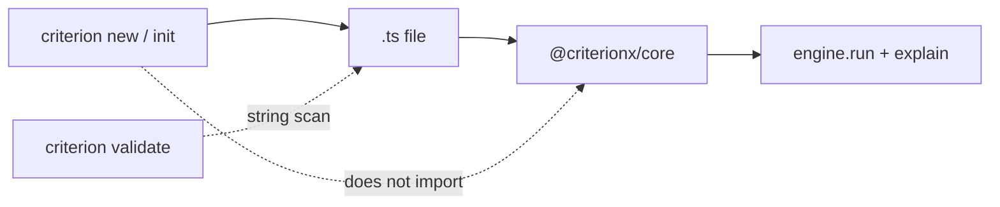

A CLI that runs the rule looks complete. Then `criterion doctor` is `engine.run`, and CI is a replica of production. A generator that *is* the decision looks honest. Then the file is a cache, and `when` waits on the next `criterion new`.

[Criterion](/work/criterionx) keeps the CLI a writer. The [`@criterionx/cli` README](https://github.com/tomymaritano/criterionx/blob/main/packages/cli/README.md) is the contract: `init`, `new decision`, `new profile`. **A scaffold is not a decision.** The binary depends on `commander` and `picocolors`. It does not import `@criterionx/core`. The generated `src/index.ts` is the one that calls `engine.run`.

The editor is [not the engine](/writing/the-editor-is-not-the-engine). A spec is [not a decision](/writing/a-spec-is-not-a-decision). This is how a terminal is allowed to touch a file.

## The problem

If the CLI evaluates the rule, every CI job is a second engine. If `validate` imported core so "it is the real check," the knife has a bin stub. If `new` wrote JSON instead of TypeScript, `when` is not a function.

[`criterion init`](https://github.com/tomymaritano/criterionx/blob/main/packages/cli/src/commands/init.ts) writes `package.json` (ESM, `@criterionx/core`, zod), `tsconfig.json`, `src/decisions/transaction-risk.ts`, and `src/index.ts`. The example decision is first-match: high, medium, then `when: () => true`. The main file constructs an `Engine`, runs `{ amount: 15000 }`, and prints `engine.explain(result)`.

[`criterion new decision`](https://github.com/tomymaritano/criterionx/blob/main/packages/cli/src/commands/new.ts) writes a kebab file with TODOs and a default rule. `new profile` writes an object, not a fork. `list` and `validate` walk `.ts` files, skip `node_modules` and `dist`, and count a file if it contains `defineDecision` and `@criterionx/core`. They parse the block for `id`, `version`, schemas, `when` / `emit` / `explain`. Empty `rules` is a warning. That is a scan. It is not `engine.run`.

## One hard decision

**A scaffold is not a decision.** `criterion new` writes TypeScript. `validate` is a string scan. Do not import core. Do not make the bin a replica of `Engine`.

If `criterion validate` returns HIGH, it is not this CLI.

## What I would not do again

Put `@criterionx/core` in the CLI so "validate is real." Then the test is a decision, and the knife has a prompt.

Let `init` emit JSON so "non-engineers can edit." Then `when` is a table, and the file is a spec you already decided not to make the engine.

## The bar

A command that writes a function you can run without the CLI, and a validate that never prints a risk score. Package: [packages/cli](https://github.com/tomymaritano/criterionx/tree/main/packages/cli). Docs: [tomymaritano.github.io/criterionx](https://tomymaritano.github.io/criterionx/). Core: [github.com/tomymaritano/criterionx](https://github.com/tomymaritano/criterionx).
