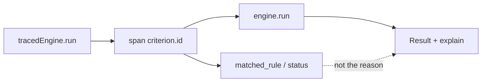

A tracer that *is* the audit trail looks complete. Then Jaeger holds *why*, and the reason you send is a span id that expires. Recording the input on every evaluation looks honest. Then the collector has the payload, and `explain()` is PII.

[Criterion](/work/criterionx) keeps tracing a wrapper. [`createTracedEngine`](https://github.com/tomymaritano/criterionx/blob/main/packages/opentelemetry/src/tracing.ts) is the contract: it calls `engine.run`, then sets span attributes. **A span is not a reason.** `recordInput` defaults off. The comment in the source is "careful with PII." `explain()` is still the audit trail.

What *why* is is written [elsewhere](/writing/if-you-cannot-show-why). The core has [no clock](/writing/the-core-has-no-clock). Packages are [not a platform](/writing/packages-are-not-a-platform). This is how a trace is allowed to watch a decision.

## The problem

If `@criterionx/core` starts a span, the unit test is a collector. If the span *is* the reason, compliance cannot send *why* without Jaeger. If `recordInput` defaults on, the payload left the function.

The span name is `criterion.{decision.id}`. `SpanKind.INTERNAL`. Attributes: decision id, version, status, `rules_evaluated`, `matched_rule`, `profile_id`, `duration_ms`. On error, `result.meta.explanation` becomes the span status message and `criterion.error`. That is a label on a trace. It is not the string you send.

`wrapEngine` does the same to an engine you already have. `getEngine()` returns the inner `Engine`. Metrics are a second wrapper: `criterion.evaluations`, `criterion.duration`, `criterion.rules.matched`, `criterion.errors`. `createMeteredEngine` records after `run`. `@criterionx/opentelemetry` takes `@opentelemetry/api` as a peer. The package depends on core. Core does not depend on it. `performance.now()` lives here, not in the knife.

## One hard decision

**A span is not a reason.** `createTracedEngine` wraps `run`. `recordInput` defaults off. Do not put Jaeger in core. Do not make the collector the audit trail.

If a hover returns a trace id instead of `explain()`, it is not this engine.

## What I would not do again

Import OpenTelemetry in `@criterionx/core` so "you always have a span." Then the knife has a clock, and the test is a collector.

Set `recordInput` true by default so "debug is complete." Then the span holds the payload, and the reason is PII.

## The bar

A trace that names the matched rule, and a reason you can send without opening Jaeger. Package: [packages/opentelemetry](https://github.com/tomymaritano/criterionx/tree/main/packages/opentelemetry). Docs: [tomymaritano.github.io/criterionx](https://tomymaritano.github.io/criterionx/). Core: [github.com/tomymaritano/criterionx](https://github.com/tomymaritano/criterionx).
