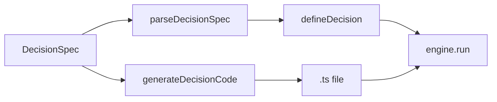

A JSON table of operators looks complete. Then `when` is a language, and a rule you cannot write is a missing `gt`. A spec that *is* the engine looks honest. Then *why* is `Rule check-age matched`, and the two numbers never make it into the audit trail.

[Criterion](/work/criterionx) keeps the spec a compiler. The [`@criterionx/generators`](https://github.com/tomymaritano/criterionx/blob/main/packages/generators/src/index.ts) package is the contract: `parseDecisionSpec` and `generateDecisionCode`. **A spec is not a decision.** Operators compile to `when`. The engine still runs the function.

Which rule fires is [first match](/writing/first-match-wins). What *why* is is written [elsewhere](/writing/if-you-cannot-show-why). This is how a table is allowed to become a function.

## The problem

If the spec is the source of truth, TypeScript is a cache, and `when` cannot be a function the operators do not have. If `explain` is only a description, the reason cannot name the threshold. If `priority` is a score, first match is a ranking again.

A spec is a shape: `id`, `version`, input / output / profile as field types, rules with `id`, `when`, `emit`. `when` is a list of conditions — `eq`, `neq`, `gt`, `gte`, `lt`, `lte`, `in`, `contains`, `matches` — or `"always"`. Values can point at `$profile.minAge`. Emit can be an arithmetic string. Rules sort by `priority` (lower first), then first match wins.

`parseDecisionSpec` calls `defineDecision`. `when: "always"` becomes `() => true`. `explain` is the rule's `description`, or `Rule ${id} matched` if you left it off. It is not a function that names the two numbers. `generateDecisionCode` writes the TypeScript you can edit.

If you need a `when` the table does not have, the file is the decision.

## One hard decision

**A spec is not a decision.** Operators compile to `when`. `when: "always"` is the default. `explain` is a description. Do not make JSON the engine. Do not grow a language so "non-engineers can edit rules."

If a hover returns a risk score from the spec, it is not this package. If `priority` picks a winner instead of sorting the list, it is not first match.

## What I would not do again

Ship the spec as the runtime so "the dashboard can edit rules." Then `when` waits on a new operator, and *why* is a description you forgot to update.

Put `new Function` in `@criterionx/core` so "expressions are first-class." Then the knife has eval, and the test is a string.

## The bar

A table that becomes a function, and a reason that still names one rule. Package: [packages/generators](https://github.com/tomymaritano/criterionx/tree/main/packages/generators). Docs: [tomymaritano.github.io/criterionx](https://tomymaritano.github.io/criterionx/). Core: [github.com/tomymaritano/criterionx](https://github.com/tomymaritano/criterionx).
