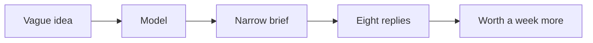

I had a vague idea: automation for small businesses. A week later I had a concept, a market, pricing, and a go-to-market outline. The model accelerated the thinking. It did not replace the calls.

## The week

Days 1–2: narrow the problem. Landed on automated invoice reconciliation for freelancers. Not “automation.” A job someone already hates.

Day 3: competitors, gaps, a rough market size. A ranking, not a promise.

Day 4: survey and interview scripts. Reached 20 freelancers on LinkedIn. Eight replies. That is the document. The model did not send the DMs.

Day 5: features, a wireframe in words, a thin architecture.

Day 6: pricing tiers, unit economics, a pitch outline.

Day 7: launch notes — content, email, possible partners.

## One hard decision

Do not let the model invent the customer. It will fill the hole with a freelancer who does not exist. The week is calls. The outline is what you can write after eight people answered.

The idea is still in progress. I know it is worth pursuing because the replies were specific, not because the chat was long.

## What I would not do again

Spend a month of nights polishing a pitch before a single call. That is a dump of the model I call research.

Ask the model for a market size and treat it as a number I can ship. A ranking. Not a promise.

## The bar

A week that produces a brief someone will answer. The last mile is still the same: eight replies — not a dump of the chat I call validation.
