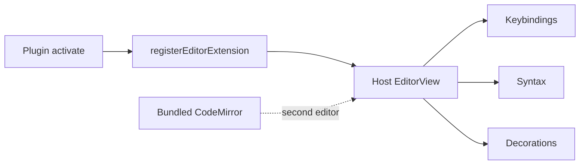

A Vim mode in the editor repo looks complete. Then `jj` waits on a desktop release, and a keymap is a product. Forking CodeMirror in the plugin looks independent. Then you shipped two editors, and disable is a reload of the window.

[Dripnex](/work/dripnex) keeps the editor in the host. The [editor page](https://github.com/dripnex/docs-site/blob/main/content/docs/architecture/editor.mdx) is the contract: in `activate()`, `context.registerEditorExtension(myExtension)`. Extensions are collected and merged. Enable or disable, the editor reconfigures. Core is not patched.

One plugin, one git repo is written [elsewhere](/writing/the-plugin-is-a-git-repo). Vim is [not built-in](/writing/a-hack-is-not-a-pack). This is how a pack touches the buffer.

## The problem

If the plugin bundles `@codemirror/*`, disable still leaves a second editor in memory. If Vim lives in app source, a chord waits on a release. If `activate()` patches a global `EditorView`, two packs fight, and neither can turn off cleanly.

What a pack can add is a list, not a license to own the surface: keybindings, syntax, widgets, decorations. Line marks, range marks, widgets, replace. The active-line highlight in core uses the same decoration API. A plugin does not get a different editor.

The host provides `@codemirror/*` and `react`. The plugin does not bundle a second copy. [plugin-vim](https://github.com/dripnex/plugin-vim) is the proof: TypeScript in `src/`, CommonJS out, CodeMirror from the app.

## One hard decision

**An extension is not a fork.** `registerEditorExtension` in `activate()`. The host reconfigures. Do not patch core. Do not ship a second `EditorView`.

If disable cannot drop the extension, it is not this editor.

## What I would not do again

Vendor CodeMirror in the pack so "it works offline from our copy." Then disable is a lie, and the keymap is two products.

Open a PR against the app for `jj`. Then a chord waits on a desktop tag.

## The bar

A pack you can turn off without restarting the window, and an editor that is still one `EditorView`. Internals: [editor](https://github.com/dripnex/docs-site/blob/main/content/docs/architecture/editor.mdx). SDK: [developers.dripnex.app](https://developers.dripnex.app). Live at [dripnex.app](https://dripnex.app).
