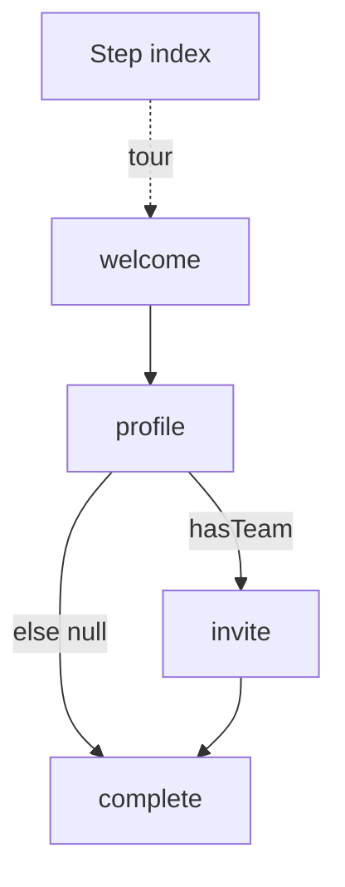

A tour that skips step four with a boolean looks branched. Then `next` is still an index, and `hasTeam` is a CSS class on the popover. A list that says "maybe invite" looks honest. Then the path lives in the renderer, skip is a hole, and a reload cannot resume a step that never had an id.

[Cairn](/work/cairn) keeps the branch on the engine. The [README](https://github.com/tomymaritano/cairn/blob/main/README.md) is the contract: `next` can be a function of live context. **An index is not a path.** `next: (ctx) => (ctx.hasTeam ? "invite" : null)`. Returning `null` ends the flow.

What owns the UI is written [elsewhere](/writing/engine-is-not-the-renderer). Persistence is [not a restart](/writing/a-reload-is-not-a-restart). This is how the trail forks.

## The problem

If `next` is `i + 1`, a team is a hidden tooltip. If the popover decides whether to show invite, the engine never saw the branch, and `flow:complete` fires on the wrong waypoint. If `canEnter` is a selector, the guard dies when the DOM changes.

[`StepTarget`](https://github.com/tomymaritano/cairn/blob/main/packages/core/src/types.ts) is a string, `null`, or `(ctx) => string | null`. [`resolveTarget`](https://github.com/tomymaritano/cairn/blob/main/packages/core/src/engine.ts) calls the function with the live context. `setContext` patches that object and emits `context:update`. A `run` that succeeds auto-advances against the updated context — that cut is [elsewhere](/writing/a-run-is-not-a-click).

`canEnter` is a guard on the same object. False skips forward to `next`. A loop of guards throws. `defineFlow<{ hasTeam: boolean }>` pins the type so `next` and `canEnter` infer without restating generics. `meta` is for the renderer. The core never reads it.

## One hard decision

**An index is not a path.** `next` is a function of live context, or it is a lie. Do not hide a branch in the popover. Do not store the next waypoint as `i + 1`.

If invite can show without `hasTeam` hitting `next`, it is not this engine.

## What I would not do again

Treat branching as "show step 4 maybe." Then the renderer owns the path, and skip never names a step.

Keep a linear list and patch it with `if (hasTeam)` in the overlay. Then two users disagree on which tooltip was step three, and the event stream is an index.

## The bar

A fork you can resume without opening the popover, and a `null` that means done. Docs: [react-cairn.vercel.app](https://react-cairn.vercel.app). Core: [github.com/tomymaritano/cairn](https://github.com/tomymaritano/cairn).
