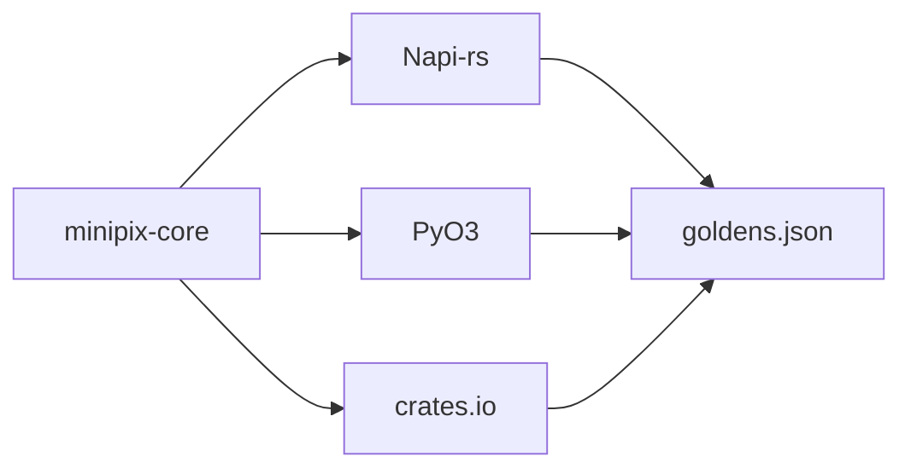

Image compression SDKs usually mean three SDKs. Node wraps one encoder. Python wraps another. Rust has a third. The bytes disagree. Someone "fixes" it in the app.

[minipix](https://github.com/tomymaritano/minipix) is one Rust core. npm, PyPI, crates.io. Same API, same engine, same output. If the hashes diverge, CI fails. That is the product.

## The problem

Bindings drift. A quality of 60 in mozjpeg is not a quality of 60 in a pure-Rust JPEG. WebP in the browser is not WebP in libwebp. You document "close enough" and then a designer diffs two exports.

I wanted the opposite: **byte-identical across languages**, verified by SHA-256 goldens against all three bindings.

PNG and AVIF must match on the native path. [Wasm is not native](/writing/wasm-is-not-native): the playground is a different contract, with its own goldens, because the browser cannot ship `libwebp` the same way.

## One hard decision

**One core, or it is not the same product.** Codecs sit behind `ImageDecoder` / `ImageEncoder`. Node and Python do not reimplement encode. They call the core. Conformance is not a README promise. It is `tests/conformance/goldens.json` in CI.

The other decision is licenses. [GPL is not a codec](/writing/gpl-is-not-a-codec): permissive tree, `cargo-deny` in CI, one documented MPL file.

The playground is 100% client-side wasm. That cut — `mozjpeg` stays native, PNG and AVIF still match — is written [elsewhere](/writing/wasm-is-not-native). Silent flattening of animated WebP is a `Decode` error, not a first-frame surprise.

## What I would not do again

Allow "close enough" across languages. Close enough is how you get two thumbnails and a support thread.

Strip metadata and skip ICC. Output pixels are sRGB because the profile was applied at decode. An untagged export is a different image.

## The bar

Same buffer in, same buffer out, in JS, Python, and Rust — or the build is red. Pre-release (`v0.1.0`). The goldens are already the contract.
