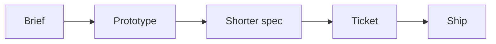

I was shipping crypto and fintech. Specs in one tool. Engineers in another. Prototypes somewhere else. The document you send is a ticket. The code that lands is someone else's translation. [Claude Code](https://claude.com/claude-code) changed who waits on whom.

## The problem

PM work is context-switching dressed as process. You write the spec. You wait for bandwidth. You look at a build that almost matches the document. You file another ticket. The interesting layer — the one under the spec — stays someone else's.

## One hard decision

Prototype before you file. If I have not seen the path in code, the ticket is a guess. The spec gets shorter because the wrong branches die on my machine. When something breaks I look before I ping the team. The boring scripts — data, reports — leave the queue. They were never tickets.

I did not go back to full-time coding. I started owning the layer under the spec.

## What I would not do again

Write the spec as if the prototype did not exist. Two documents. They drift.

Hand a dump of the chat to engineering. That is not a spec. That is a model.

## The bar

A ticket someone can build without translating. The last mile is still the same: a short, house-voice change — not a dump of the prompt I call a spec.
