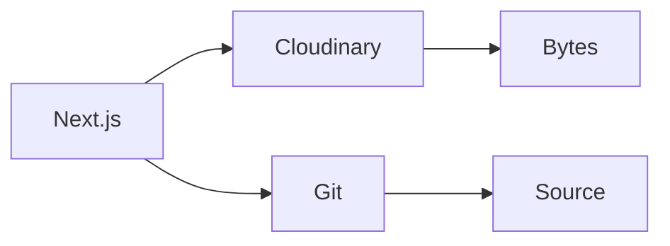

The repo was 450MB. After the images left for [Cloudinary](https://cloudinary.com/) it was 1.2MB. That is not a migration story. That is git doing a job it was not asked to do.

## The problem

Images in the repo look convenient. Then clone is slow. CI is slow. Nothing is resized. Binary diffs are noise. Every pull is a tax on a PNG you already shipped.

## One hard decision

Move the bytes. Keep the references. Bulk upload. Point `images.remotePatterns` at `res.cloudinary.com`. Wrap URLs in a helper. Search-and-replace. About an hour.

Cloudinary was the boring choice: WebP and AVIF on the way out, resize on the fly, a CDN, a usable free tier, a clean Next.js path. I did not need a second product. I needed the repo to be source again.

Build went 3min → 45sec. Page load 2.4s → 0.8s with automatic WebP. The 99.7% drop is the clone. The hour is the cheap part.

## What I would not do again

Commit a “just this hero.” The next one stays. Then CI is the product.

Hand-resize three widths in `public/`. That is a CMS you will not finish.

## The bar

A repo you can clone. Images that arrive in the format the browser asked for. The last mile is still the same: a page someone will load — not a dump of the binary I call a commit.
