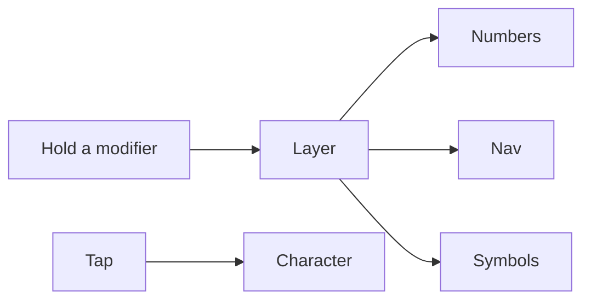

A full-size board is a dump of the keyboard. Every key is a special case. The [Corne](https://github.com/foostan/crkbd) (crkbd — Corne keyboard) is the opposite: two halves, 3×6 column stagger, three thumbs each. Forty-two keys. Designed by foostan, open source, still the default split people actually finish.

I type on one. The interesting part is not the solder. It is the contract.

## The problem

A row-staggered 104-key board asks your wrists to meet in the middle and your fingers to reach for keys that were placed for typewriters. You compensate with software: snippets, a window manager, a second language layer you never finish.

The Corne removes the keys you were already avoiding. What remains has to earn a layer.

## What 42 keys actually are

Ortholinear columns, not a typewriter stagger. Split, so the wrists stay where the shoulders are. Thumbs do the work pinkies used to do.

Home-row mods and thumb layers are the same idea as a state machine for onboarding. The base layer is the default path. Everything else is a branch you can name. If two layers do the same job, they will drift. You will not notice until a chord fires the wrong one.

Firmware is QMK if the halves talk over TRRS and live on a Pro Micro class chip. It is [ZMK](https://zmk.dev/) if you want wireless on nice!nano boards and a GitHub Action that spits out a UF2. I do not care which logo is on the `.uf2`. I care that the keymap is a file I can read.

## One hard decision

Do not add keys to dodge a layer. A 36-key Corne (drop the outer columns) is a stricter contract. A 42-key Corne is the one I can still touch-type numbers on without inventing a numpad layer I will hate. I kept 42.

Wireless is the other fork. ZMK plus a dongle (the left half stops being the USB tax) is the right call if the desk is already a mess of cables. Wired QMK is the right call if you want the keymap to compile on your machine and you do not want another Bluetooth pairing story. Pick one. Flashing both stacks is two products.

## What I would not do again

A keymap I cannot draw. If I cannot see the layers on one screen, I will keep a cheat sheet and never learn the board.

RGB as identity. The Corne already looks like a tool. Lights do not make the contract clearer.

A layer for “everything else.” That is the dump. Split it or delete it.

## The bar

Forty-two keys. Named layers. One firmware. Thumbs do the modifiers. The last mile is still the same: the character I meant, on the first try — not a dump of the model I call a keyboard.
