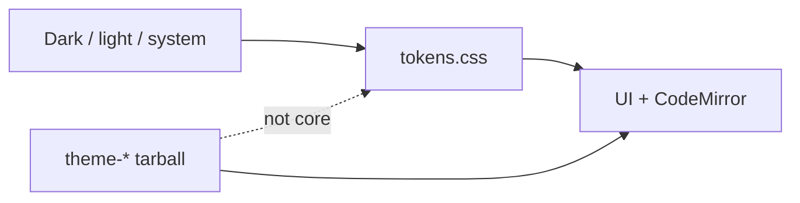

A desktop that ships Solarized looks finished. Then a font color is a release, and a community palette waits on the app. A theme that rewrites Markdown looks pretty. Then export is not what you typed.

[Dripnex](/work/dripnex) keeps Default in core. The [themes page](https://github.com/dripnex/docs-site/blob/main/content/docs/themes.mdx) is the contract: named palettes are not in the desktop. `OFFICIAL_THEMES` is `[]`. Default appearance is the built-in `tokens.css` layer. Extra palettes are satellite packs (`dripnex/theme-*`).

Personal CSS is a different cut — [a hack is not a pack](/writing/a-hack-is-not-a-pack). This is the product chrome.

## The problem

If named palettes live in core, every color is a desktop version. If Default is a pack, first launch needs a tarball. If a theme mutates the note, export is a restyle.

Themes change the UI and the editor. They do not change the Markdown. Dark, light, and system live as `data-color-scheme` on the root. System follows the OS. CodeMirror uses the same tokens — not a second theme file that can drift.

**Settings → Themes.** In use is Default plus palettes you already installed. Available palettes are first-party packs. Install is one click: the app fetches that pack’s GitHub Release tarball (`bundleUrl`). If that fails, **Settings → Plugins → Install → Other package**. A git tag without the tarball is not enough. There is no public theme store.

How to *write* a `dripnex/theme-*` pack is the SDK at [developers.dripnex.app](https://developers.dripnex.app) — not a marketplace, and not this desktop. Internals: [theming](https://github.com/dripnex/docs-site/blob/main/content/docs/architecture/theming.mdx).

## One hard decision

**Default is not a palette.** `tokens.css` is core. Named palettes are tarballs. A color scheme is not a marketplace.

Do not wait on a desktop release to install Harbor Dusk. Do not wait on GitHub to read the first note.

## What I would not do again

Bundle Solarized so "we have themes." Then a community color waits on a desktop tag.

Make Default a satellite so "everything is a pack." Then first launch needs a download, and the tokens file is no longer the product.

## The bar

A default you can read without a download, and a palette you can install without a release of the app. Docs: [themes](https://github.com/dripnex/docs-site/blob/main/content/docs/themes.mdx). Live at [dripnex.app](https://dripnex.app).
