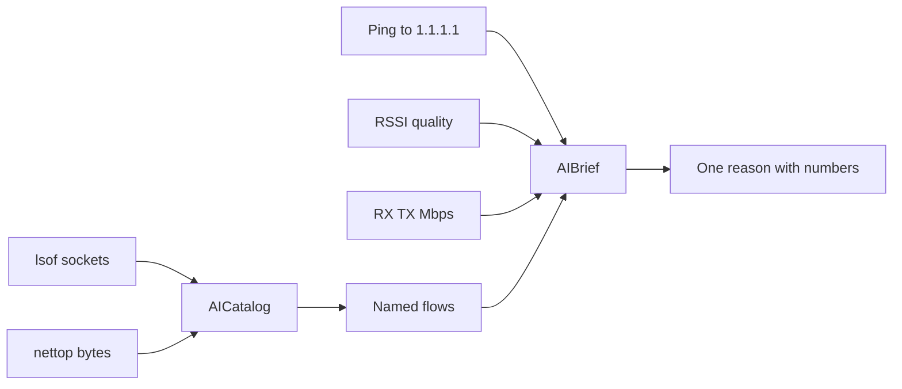
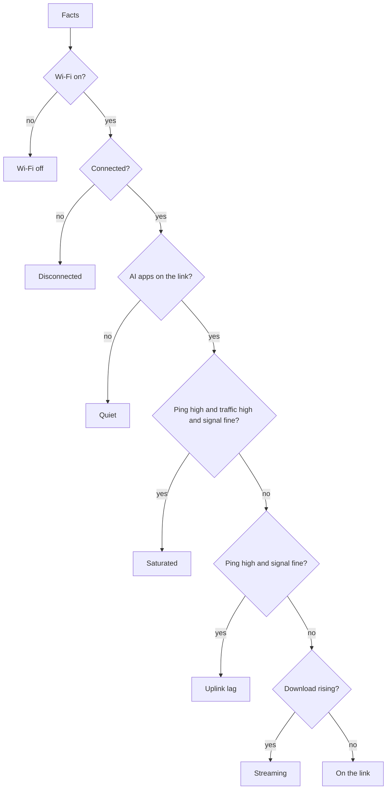

A speed test tells you the pipe is wide. Activity Monitor tells you a process is loud. Neither tells you why the ping moved while Cursor was streaming. [DevWifiBar](https://github.com/tomymaritano/devwibar) is the menu bar for that question. Native Swift. No Dock. Same cutoffs as the [`devwifi`](https://github.com/tomymaritano/devwifi) CLI, always visible.

The interesting decision is not the icon. It is what the radar is allowed to see.


## The problem

I run three or four LLM apps on one Mac. The ping to 1.1.1.1 jumps. RSSI is still Excellent. The reflex is “Wi-Fi died.” The radio is fine. A helper process is filling the uplink.

If you open the packet to prove it, you have a different product. A sniffer. A keychain story. A privacy review you will not finish. If you ask a model to rewrite the facts, you get a slogan. Slogans drift.

## What the radar is allowed to see

Process name. Destination host. Interface counters. Ping. RSSI. That is the catalog.

`lsof` says who holds an established TCP socket. `nettop` says how many bytes moved. [`AICatalog`](https://github.com/tomymaritano/devwibar/blob/main/Sources/DevWifiCore/AICatalog.swift) matches `Cursor Helper` or `api.anthropic.com`. It does not match `evilopenai.com`. Chrome talking to `api.openai.com` is OpenAI. Chrome talking to an IP is ignored. Slack is ignored. `node` without a known host is ignored.



Nothing inside TLS. No payload. No keychain. The help text on the panel says that in one line.

## One spine for the verdict

[`AIBrief.diagnose`](https://github.com/tomymaritano/devwibar/blob/main/Sources/DevWifiCore/AIBrief.swift) is a function you can test. Offline. Disconnected. Quiet. Streaming. Uplink lag. Saturated. Live.

The numbers are not vibes. Latency is high above **80 ms** and clears below **60 ms**. Saturate above **2.5 Mbps** and clears below **1.6 Mbps**. If ping is high and signal is Excellent or Good, the verdict is the host — not RSSI. Hysteresis holds Saturated while it cools so the title does not flicker.

Evidence is three chips: Ping, Traffic, Signal. The reason is one sentence with the numbers in it. `120 ms` is over `80 ms`. Traffic is over `2.5 Mbps`. Signal is Excellent. Claude is filling the pipe.



There is an `AINarrator` that can ask Foundation Models to polish the sentence on a future macOS. The product does not depend on it. If the rewrite is empty or longer than 160 characters, the rule-based reason stays. **No slogan rewrite.** The chips are the document.

## The widget is not a second radar

WidgetKit will not run `lsof` in the sandbox. I did not pretend it could. The app writes a snapshot to an app group. The extension reads it. System widgets refresh about every five minutes. Radar only appears after DevWifiBar has written. Live radio and IP can merge in. The verdict does not get recomputed from a crippled process list.

That is the same spine as a report section. If first run and regenerate are two functions, they drift. If the bar and the widget are two radars, they will disagree.

Location is Apple’s tax. CoreWLAN will not give you SSID without CoreLocation. Asked once. Without it the panel still shows RSSI, IP, traffic, DNS, and latency. The name stays “Wi-Fi”. The verdict does not wait on the name.

## What I left in the CLI

Password reveal, QR share, speed test, DNS switching, device scan, alerts. Those live in [`devwifi`](https://github.com/tomymaritano/devwifi). Putting them in the bar is a second product. The bar is always visible, one click deep. The CLI is the dump you run when you asked for a dump.

Native. `LSUIElement`. Homebrew cask, ad-hoc signed, Gatekeeper on first launch. v0.2.0 ships a widget gallery in the panel — same idea as adding Desktop widgets, different density per card. Install is three lines:

```bash
brew tap tomymaritano/tap
brew install --cask devwibar
open -a DevWifiBar
```

## What I would not do again

Ask a model to narrate the chips. The first sentence looks friendlier. The third week it has forgotten the numbers.

Treat Chrome as ChatGPT because someone opened `api.openai.com`. The host is the classification. The browser is not the product.

Run `lsof` inside the widget. The sandbox will say no. You will invent a second catalog to cope.

Put a speed test in the popover. That is a button that lies about the last thirty seconds.

## The bar

Process names and destinations. Three chips. One reason with numbers. If signal is Excellent and ping is 120, the model is the load. The last mile is still the same: a verdict someone can check — not a dump of the packet.
