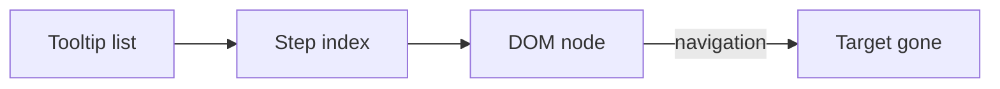
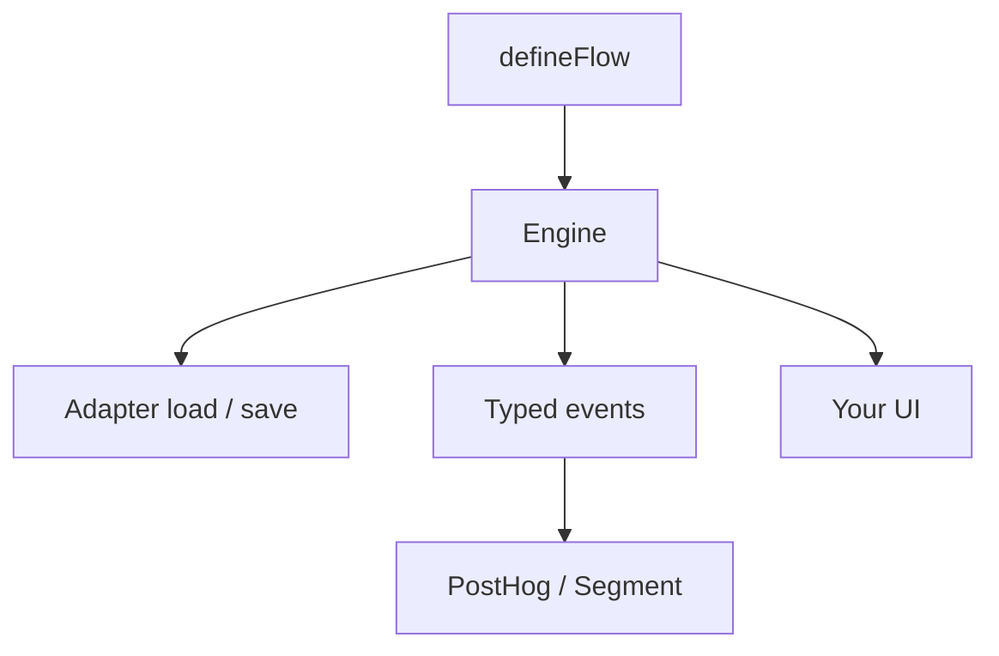

Tour libraries sell a list of tooltips. Real onboarding is not a list. It branches on whether the user has a team. It spans three pages and a reload. It needs an event you can send to PostHog without bolting a tracker onto a popover.

I built [Cairn](/work/cairn) because the renderer kept dying and the path kept living in someone else's head.

## The problem

Joyride, Shepherd, Intro.js — linear steps, coupled to the DOM. `next` is an index. A route change unmounts the target. You patch it with "wait for the selector." You patch the patch with a delay. Analytics is a callback you remember to fire.

That is a tour. It is not a workflow.

The interesting product is not the spotlight. It is the path: which waypoint, under which context, with a history you can resume.

## One hard decision

**The engine is not the renderer.** Cairn owns the state machine — waypoints, `next(ctx)`, history, persistence, a typed event stream. You own the UI. Skip `cairn-ui` if you want. Render from `useFlow()`. The core has no React. React is the first binding.

A tooltip library dies when the DOM changes. A state machine survives navigation because the current step is data, not a node.

Persistence is a three-method adapter. A reload is [not a restart](/writing/a-reload-is-not-a-restart).

Events are the analytics. That cut — pipe `onAny`, do not invent a tracker in the overlay — is written [elsewhere](/writing/the-popover-is-not-the-firehose).

## What I would not do again

Ship a tour that owns the markup. The day the design system changes, the library is a fork.

Treat branching as "show step 4 maybe." An [index is not a path](/writing/an-index-is-not-a-path): `next` is a function of live context or it is a lie.

## The bar

You place the markers. The user finds the way. Cairn is the stacked stones — not the landscape, not the boots. Docs at [react-cairn.vercel.app](https://react-cairn.vercel.app).
