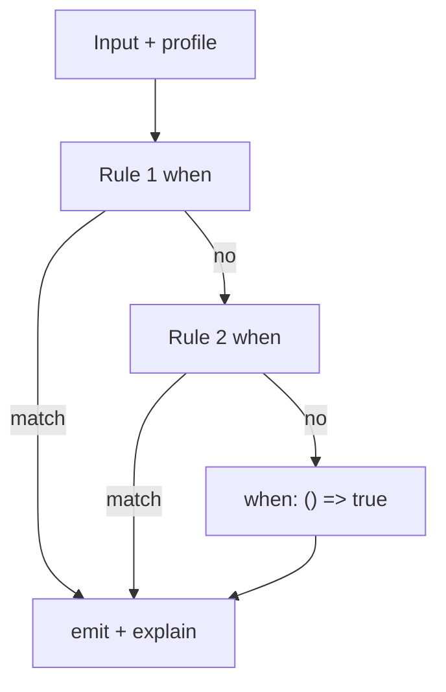

A decision engine that scores every rule looks fair. Then *why* is a ranking, and two reviewers will argue about the weights. A model that picks the "best" match looks smart. Then same input is not the same output, and you cannot send the reason.

[Criterion](/work/criterionx) keeps the cut boring. The [README](https://github.com/tomymaritano/criterionx/blob/main/README.md) is the contract: rules are evaluated in order. **First match wins.**

What *why* even is — the audit trail — is a different decision, written [elsewhere](/writing/if-you-cannot-show-why). This is how a rule fires.

## The problem

If every matching rule contributes a score, the result is a blend you cannot re-run in your head. If later rules can override earlier ones silently, the list is a lie. If there is no default, a miss is an exception in production.

The high-risk example in the README is the shape: `when` amount > profile threshold, `emit` HIGH, `explain` the two numbers. Next rule: `when: () => true`, LOW. Fifteen thousand against a ten thousand threshold matches the first rule. The second never runs.

A profile changes the threshold — US versus EU — not the order. The function does not fork.

## One hard decision

**First match wins.** Rules run in order. The default is `when: () => true`. Do not rank. Do not blend. Do not ask a model which rule "feels" right.

The reason you send is the rule that matched, its id, its version, and the string `explain` returned. Not a weighted table of near-misses.

## What I would not do again

Score every `when` and pick the maximum. Then *why* is a ranking, and the ranking is a second product.

Leave off the default so "it should always match something." Then a miss is an incident, not a rule you can read.

## The bar

A list you can re-run with a finger, and a reason that names one rule. A spec that sorts by `priority` is a compiler, written [elsewhere](/writing/a-spec-is-not-a-decision). Dead rules after the default are [not a ranking](/writing/a-dead-rule-is-not-a-ranking). Docs: [tomymaritano.github.io/criterionx](https://tomymaritano.github.io/criterionx/). Core: [github.com/tomymaritano/criterionx](https://github.com/tomymaritano/criterionx).
