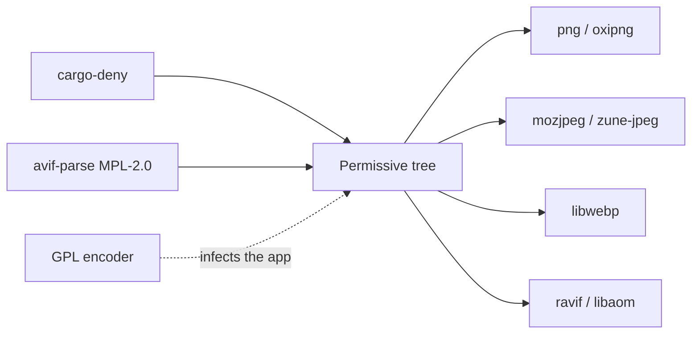

A faster AVIF crate that is GPL looks cheap. Then every app that compresses a thumbnail is a GPL product, and the license is the encoder. Ignoring `avif-parse` because "we didn't modify it" looks sloppy. Documenting the exception and pinning `cargo-deny` is the product.

[minipix](https://github.com/tomymaritano/minipix) keeps a permissive tree. The [README](https://github.com/tomymaritano/minipix/blob/develop/README.md) is the table: PNG MIT/Apache, JPEG BSD-3/IJG, WebP BSD-3, AVIF BSD-2 plus a patent grant on `libaom`. Color is `moxcms`, BSD-3/Apache. No GPL. No LGPL. No AGPL.

Byte-identical across languages is written [elsewhere](/writing/byte-identical). Wasm is [not native](/writing/wasm-is-not-native). This is what you are allowed to ship inside.

## The problem

If the encoder is GPL, the app is GPL. If you vendor a copyleft crate and skip CI, a dependabot bump is a license change you will not see until a lawyer does. If you rewrite AVIF to dodge MPL, you now own a parser.

The one exception is written down: `avif-parse` is MPL-2.0, file-level copyleft, consumed unmodified. Weak copyleft that does not reach minipix or its users. The rationale lives in `deny.toml`. CI fails the graph, not a README promise.

minipix itself is MIT or Apache-2.0, at your option. That is the same family as the codecs, not a third story.

## One hard decision

**GPL is not a codec.** Permissive tree. `cargo-deny` in CI. `avif-parse` is the one documented MPL file, unmodified. Do not take a faster encoder that infects the app.

If it is not in `deny.toml`, it is not this library.

## What I would not do again

Pull a GPL AVIF because "it's smaller." Then a thumbnail is a license, and the license is the product.

Leave `avif-parse` off the exception list so "CI is cleaner." Then the next audit is a surprise.

## The bar

A graph `cargo-deny` will still pass next month, and one MPL file you can point at. README: [github.com/tomymaritano/minipix](https://github.com/tomymaritano/minipix). Pre-release (`v0.1.0`).
