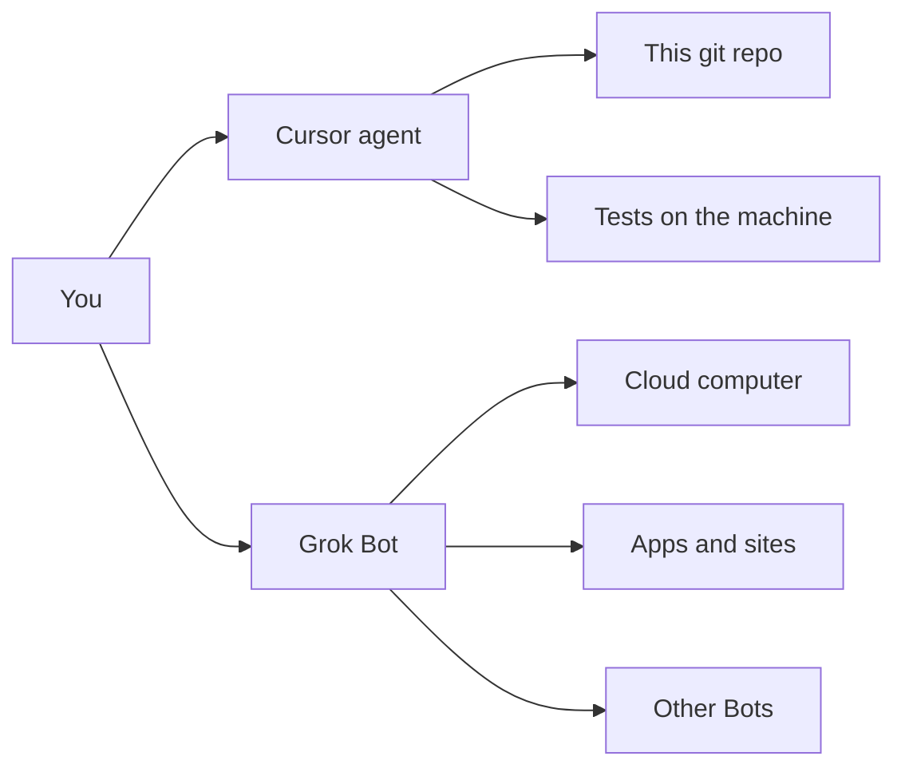
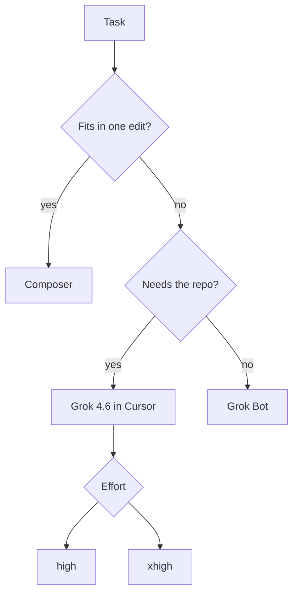
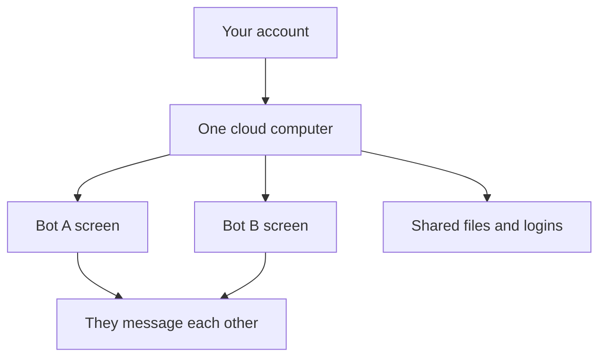

Two products shipped with the same first name in 2026. [Grok 4.6](https://cursor.com/blog/grok-4-6) is a model you pick inside Cursor. [Grok Bot](https://x.ai/bot) is a named teammate on a cloud computer. If you treat them as one agent, you will ask the wrong loop to do the job.

I have been running Grok 4.6 in Cursor on this site. Long sessions. Research, then a diff, then a review. I have not stood up a fleet of Grok Bots against Psynth. This is a field note from the loop I actually ran, and a reading of the Bot docs so I do not confuse the two.

## Two products, one brand

Cursor and SpaceXAI released Grok 4.6 together on 12 August 2026. The pitch is specific: long-running agents, multi-step work, stronger first passes on interactive and visual projects. In the app it shows up as **Cursor Grok 4.6**. Composer stays for cheap, short edits. 4.6 is the general model when the session will not fit in one turn.

Grok Bot is a different surface. A Bot is a persistent, named agent. It gets a browser, a filesystem, a terminal, on a cloud VM that keeps running when the laptop lid closes. You message it like a teammate. It comes back when something needs approval. Beta, for SuperGrok Heavy, Cursor Ultra, and Cursor Teams Premium.

If the work is a branch in a repo, use Cursor. If the work is “sign into the tool, click the thing, leave me a draft,” that is a Bot. Mixing them produces a chat that never writes the file, or an agent that cannot see Salesforce.

## What 4.6 is trained to stay with

The public writeup is not vague. Supplemental training after 4.5. SFT traces regenerated with 4.5, then filtered. RL on knowledge work, general coding, kernel work, web apps, CAD. The eval they quote is a match with GPT-5.6 Sol on the Artificial Analysis Intelligence Index — a composite of nine benchmarks. Treat that as a ranking, not a promise about your repo.

What I care about is the loop they optimized:

1. A broad brief.
2. Research in an unfamiliar corner.
3. A first version that has a structure.
4. Several rounds of feedback without dropping the thread.

That is this portfolio. Home is the about. Work is products, roles, clients. Writing is the technical post. The agent that dies after the first file is useless. The agent that keeps the thesis in its head for an hour is the product.

Effort is a real dial: **low**, **medium**, **high**, **xhigh**. Named default is high. Auto uses high. Cursor Start pins 4.6 at medium and blocks Fast. I leave it on high unless the task is a rename. xhigh is for the session I do not want to babysit. Pricing on the API side is published at $2 / $6 per million in/out; a fast variant is 2×. Inside Cursor it comes out of the first-party usage pool, same treatment as 4.5.

## The Cursor loop I actually use

The agent is not a chatbot with a file picker. It reads the tree, runs commands, opens a browser, and comes back with a diff. Multitask mode parks a worker and lets me keep talking. Cloud agents do the same job on a VM when I do not want the laptop warm.

The failure mode is the same one I wrote about for report generation. If “research” and “edit” are two products, they drift. The research worker invents a tone. The edit worker implements a different one. **One spine.** The brief that starts the worker has to be the brief that reviews the diff.

What I would not do again: ask 4.6 to invent a product URL, a metric, or a patient sentence. The model will fill the hole. The hole is the bug. Same rule as a clinical draft. Visible refusal is kinder than a quiet amputation.

Grok 4.6 is also the first Cursor Grok they call out for following a pile of skills and rules without going mute. That matters here. This repo has a voice. If the agent ignores it, I get LinkedIn cadence in a site that spent a week killing LinkedIn cadence.

## Grok Bot is a computer, not a buffer

The [overview](https://docs.x.ai/grok-bot/overview) is the useful document. A Bot:

- Runs on a persistent cloud VM.
- Uses connectors and MCP when they exist.
- Uses computer-use when they do not — the apps with no clean API.
- Keeps memory, files, and browser sessions across turns.
- Can watch you do a path once and save it as a routine.

Several Bots share **one** user-scoped computer. They share files and logins. Each Bot gets its own screen so they can click in parallel. They do **not** get separate security boundaries. A cookie you leave for the ops Bot is available to the inbox Bot. Docs say this in plain language. Treat it as true.

That is why a Bot can hand off without you pasting a zip. It is also why you do not put a production admin session on that VM “just to try.” Approvals exist. Local actions from a Bot go through Auto-review. The first local command asks. After that, the card shows the exact command. Still one computer.

Availability is not “anyone on Cursor.” Ultra, Teams Premium, SuperGrok Heavy. Enterprise is a waitlist. Team settings for privacy, MCP, and Cloud Agents apply. A toggle can stop Bots from launching Cursor cloud agents. MCP auth is shared with Cursor. You do not get a second allowlist.

I have not run that stack. I am not going to write a victory lap about a Bot I did not hire. The product shape is clear enough to place it: **Bot is for work that lives in other people’s apps. Cursor is for work that lives in git.**

## One hard decision

Do not put Grok Bot on the clinical path. A Bot that can sign into tools is a new surface for the same document. Gen and regen already drift if they are two functions. Adding a teammate that clicks the admin is a third function. The report someone signs still has to come from one spine. [How a report section is generated](/writing/section-generation-pipeline) is that argument. The Bot does not change it.

For this site, the decision was the other way. The work was files. Grok 4.6 in Cursor, high effort, one worker that could hold the thesis. When I split research and implementation into two agents without a shared brief, the copy forked. I stopped doing that.

## What I would not do again

Call the model “the Bot” inside Cursor. Names matter. The model is 4.6. The Bot is a VM.

Let Auto pick effort on a voice pass. Auto is high. High is correct. The failure was the brief, not the dial.

Paste a Salesforce example from the docs into a healthcare system. The docs’ first handoff is a prospects list. That is a fine Bot task. It is a terrible shape for anything with PHI.

## The bar

Grok 4.6 stays with the repo until the diff matches the brief. Grok Bot stays with the computer until the draft needs a person. Do not run both as if they were one agent. The last mile is still the same: a short, house-voice change someone will ship — not a dump of the model.
