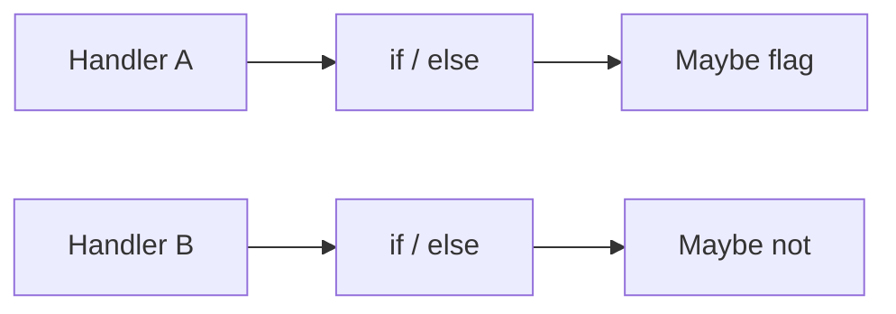
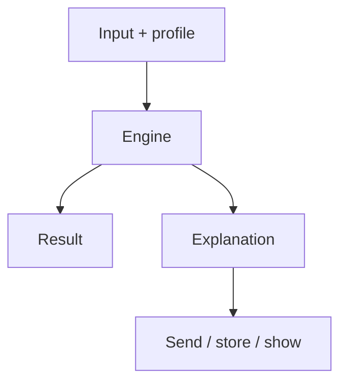

Business-critical calls hide in `if/else` across a codebase. Should this transfer be flagged. Is this user on the premium tier. What discount applies. When someone asks *why*, you grep. You reconstruct. You guess.

I built [Criterion](/work/criterionx) so the answer is the return value, not a story you tell later.

## The problem

A decision that is not a function is not testable. A decision with a side effect is not repeatable. A decision without an explanation is not auditable. Compliance does not want your confidence. It wants the matched rule and the numbers that fired it.

Scattering the logic looks faster than extracting an engine. After a year you have three copies. They disagree on the threshold. Only one is in the ticket.

Same input. Two outputs. No reason you can send.

## One hard decision

Keep it a **micro engine**. Not a workflow product. Not a model. Not a marketplace.

Pure functions. Zod on input, output, and profile. Rules with `when`, `emit`, and `explain`. The engine runs them. Same input, same output. `explain()` is the audit trail — rule id, version, reason string.

A profile is how you parameterize without forking the function. Region, tier, environment. The rule does not change. The threshold does.

Zero I/O in the core. No database, no fetch, no clock. If it needs a clock it is not this engine. Side effects live outside. That is how you test it: pass the object, assert the object, read the explanation.

[Packages are not a platform](/writing/packages-are-not-a-platform). Core, server, React, Express, tRPC, a CLI, an MCP server. The core must stay boring enough that an LLM can call it and a human can read the reason.

## What I would not do again

Let the decision grow a workflow. The moment it has a queue, it has a second product.

Ask a model for the decision and call the prose the reason. Prose is not deterministic. The reason has to come back the same way the result does.

## The bar

Someone can show *why* without opening the repo. A span is [not that reason](/writing/a-span-is-not-a-reason). Docs at [tomymaritano.github.io/criterionx](https://tomymaritano.github.io/criterionx/).
