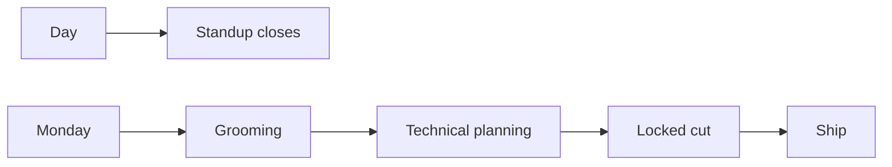

I am Lead Engineer at [Psynth](https://psynth.ai). I joined as a design engineer. The title is not a calendar. It is who locks the cut and who ships it.

This is how a day actually runs — and how the team splits the work. No patient content on this page.

## Close the day, do not open it

Our standup is not a morning status parade. It is how we thank the day. What landed. What blocked. What we are grateful we finished before we leave it open overnight.

A standup that only lists tickets invents motion. A standup that names the closed loop — merge, deploy gap, fail-visible cut — keeps one spine. If gen and regen are two products, they drift. The same rule applies to the day: if "done" and "on the board" are two truths, the clinician will feel it later.

## Monday: groom, then plan

Mondays have two meetings in order. Grooming first. Technical planning second.

Grooming is the filter. Is this a real cut or a parallel ticket. Does Linear already own it. Are we inventing product scope. Fail-visible is non-negotiable — truncation that looks finished is worse than a visible failure.

Technical planning is the how. Same input, same spine. Which repo, which branch, which precondition. Not a second architecture debate. The locked cut is already the decision. Planning is how we land it without a twin path.

## My work

I own the engineering cut once product has locked it. Design engineer first meant the surface. Lead means the surface and what it sits on: generation spine, report status that tells the truth, residency and PHI paths that fail closed, CI that unblocks the next merge.

I do not invent architecture in the middle of a sprint. I do not open a parallel ticket because Linear was stale. If the code is already on develop and the board still says In Progress, the board is wrong — move the board, do not rewrite the cut.

The quality bar is the same one I wrote for section generation: one spine, visible failure, no dump of the model. The last mile is still a short document a psychologist will send.

## The team's work

The team is not one role wearing five hats. Product locks cycle and priority. Architecture maps the real runtime — what receives traffic, what is a leftover twin, what to eliminate. Delivery keeps the board honest so progress is not a story. Security finds live bleed and residency gaps without turning every finding into a rewrite. Engineering implements the locked cut.

When those roles blur, you get two products again: a board that says Done and a cluster that still runs the old path. When they stay separate, Monday planning is short. The standup at the end of the day has something real to thank.

## What I would not do again

Treat Lead as "I attend every meeting." The meetings exist so the cut stays one cut.

Groom and plan in the same breath. Grooming without a technical plan is a list. Planning without grooming invents scope.

Open a second ticket for work that already shipped. Hygiene is part of the lead job.

## The bar

Standup closes the day with gratitude and a true state. Monday grooms, then plans the locked cut. Lead is who keeps one spine — not who collects the most status.
