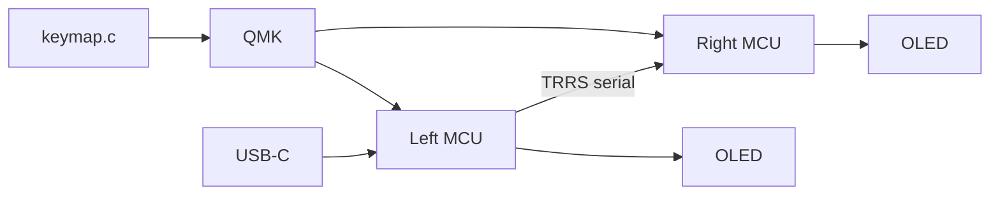

A [Corne](/writing/corne-keyboard) is a 42-key contract. The [Lily58](https://github.com/kata0510/Lily58) is the same idea with a number row that earned a physical column. Four rows of six, five thumbs a side. Fifty-eight keys. Column stagger, split, open PCB. Designed by Naoki Katahira.

I type on one. The interesting part is not the acrylic. It is that the keymap is a file, the MCU is a flash target, and the switch is the last millimetre of the contract.


## The problem

A 104-key board is a dump of the keyboard. Every key is a special case. A 42-key Corne is strict: numbers live on a layer. That is the right call until you are in a file all day and the layer is a tax.

The Lily58 does not add a numpad. It adds the column the number row was already occupying in my head. What remains still has to earn a layer.


## The chip is not the keymap

Each half is a Pro Micro-class controller — USB-C, OLED stacked on top, TRRS on the side. ATmega32U4 (Elite-C) or RP2040 in the same footprint. I do not care which logo is on the silicon. I care that QMK will compile for `lily58`.

The left half is USB. It is the master. The right half is a slave over the TRRS cable. Serial, not magic. Powered halves plus a hot-plugged TRRS is how you short a GPIO. Plug the TRRS first. Then USB.



Programming is a compile, not an app.

```bash
qmk compile -kb lily58 -km default
qmk flash
```

Reset into the bootloader. AVR gets `avrdude`. RP2040 becomes a disk and takes a `.uf2`. Same keymap file. The OLED is a QMK driver: layer name, maybe WPM. It is telemetry. It is not RGB as identity.

VIA is a dump of the keymap into a GUI. A `keymap.c` you can read is the product. If I cannot draw the layers on one screen I will keep a cheat sheet and never learn the board.


## Whites are the last mile

The housings are white. Linear. Light. No bump, no click.

A tactile wants a story at the actuation point. A clicky wants a room that is not a call. Linear whites bottom out the same way every time. For a day of writing and a night of a keymap, that is the point. The finger does not wait on a leaf spring to tell it the key happened. The firmware already did.

Gateron White-class: ~35–38 g, cream housing, MX stem. They are not “quiet gaming.” They are the switch that does not add a second product under the keycap.


The last mile is still the same as the rest of this site: the character I meant, on the first try — not a dump of the model I call a keyboard.

## Why it is on this site

This board is the input device of the work. Psynth, Dripnex, DolarGaucho — they all start as keys. If the keymap is a mess, the document is a mess with extra steps.

I keep it here for the same reason I keep the Corne note: **layers are the product.** The PCB is the case. QMK is git. Whites are the actuator. OLED is a status line. None of that is a flex. It is the same thesis as a report section: one spine, named branches, nothing silent.

The extra column is the honest part. I did not pretend a 42-key board was enough for numbers I type every hour. I also did not buy 104 keys to dodge a layer. Fifty-eight is the contract I can still draw.

## One hard decision

Keep the number row physical. Put nav and symbols on thumbs. Do not grow a “everything else” layer. That is the dump. Split it or delete it.

Wired QMK, not wireless ZMK, on this one. The desk already has a TRRS. I want the keymap to compile on this machine. A dongle is a second pairing story. I already wrote that fork on the Corne. Pick one per board.

## What I would not do again

RGB as identity. The underglow is a power LED I can see in the dark. It is not a skin.

A keymap I cannot flash twice the same way. If left and right need different `.hex` files I will flash the wrong half at 1 a.m.

Hot-swapping TRRS while USB is live. The MCU does not enjoy that.

## The bar

Fifty-eight keys. Linear whites. One `keymap.c`. The OLED says the layer. The last mile is still the same: the key I meant — not a dump of the board I call a layout.
