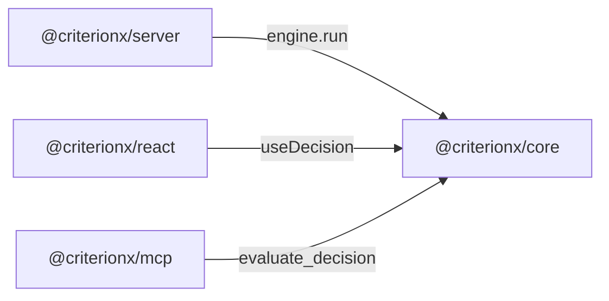

A monorepo that ships HTTP, React, and an MCP server looks complete. Then the engine imports Express, and the test is a port. A "platform" that auto-discovers decisions looks helpful. Then the registry is magic, and *why* includes a file the caller never passed.

[Criterion](/work/criterionx) keeps the cut in the [README](https://github.com/tomymaritano/criterionx/blob/main/README.md): packages for React, Express, tRPC, OpenTelemetry, a CLI, an MCP server. The [core README](https://github.com/tomymaritano/criterionx/blob/main/packages/core/README.md) is the contract: HTTP-agnostic. Never depend on server concerns. **The core is a knife, not a Swiss Army knife.**

Zero I/O is written [elsewhere](/writing/the-core-has-no-clock). What *why* is is [elsewhere](/writing/if-you-cannot-show-why). The editor is [not the engine](/writing/the-editor-is-not-the-engine). A span is [not a reason](/writing/a-span-is-not-a-reason). This is how the repo is cut.

## The problem

If `@criterionx/core` can listen on a port, you cannot unit-test a rule without standing up a server. If the server can invent a default, the docs lie about what the decision requires. If the MCP package writes the rule instead of calling it, the LLM is the engine, and the reason is prose.

The [server README](https://github.com/tomymaritano/criterionx/blob/main/packages/server/README.md) is the other half: the server is a delivery mechanism, not a decision engine. It does not add logic. It calls `engine.run()`. Decisions are registered. No auto-discovery. JSON Schema is primary; OpenAPI is derived.

MCP is four tools on the same function: `list_decisions`, `get_decision_schema`, `evaluate_decision`, `explain_result`. An LLM can call it. A human can read the reason. The model does not own the cut.

React is `CriterionProvider` and `useDecision`. Express is `createDecisionRouter`. They take the same `decisions` array the core already has. They do not grow a second engine.

## One hard decision

**Packages are not a platform.** Core stays a knife. Server, React, Express, tRPC, and MCP call it. Do not put HTTP in core so it is "one install." Do not auto-discover so the server is "smarter."

If a package needs I/O, it is not core. If a package needs to invent a default, it is not this engine.

## What I would not do again

Fold Express into `@criterionx/core` so "you always have a route." Then the test is a listener, and the knife is a kit.

Let the MCP server draft the rule. Then *why* is a chat, and the chat is a second product.

## The bar

You can install only core. An LLM can call the same function. A human can read the reason. Docs: [tomymaritano.github.io/criterionx](https://tomymaritano.github.io/criterionx/). Core: [github.com/tomymaritano/criterionx](https://github.com/tomymaritano/criterionx).
