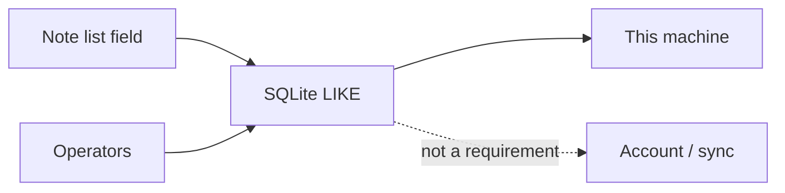

A note app that searches the server looks live. Then offline is a lie: you cannot find a tag unless the words already left the machine. A client that waits on FTS before shipping a field looks complete. Then nobody can find last week's meeting.

[Dripnex](/work/dripnex) searches on the machine. The [search page](https://github.com/dripnex/docs-site/blob/main/content/docs/search.mdx) is the contract. [ADR-003](https://github.com/dripnex/docs-site/blob/main/content/docs/decisions/adr-003-storage.mdx) is why the first index is SQL `LIKE`, not a hosted engine.

Tags live beside the Markdown — that cut is written [elsewhere](/writing/tags-are-not-the-body). This is how you find them.

## The problem

If search is a cloud index, Don't Sync cannot find a note. If search is a folder walk, operators are grep folklore. If you wait for FTS5 before shipping a field, the list has no find.

Type in the note list. Titles and bodies match. Operators narrow: `tag:name` or `#name`, `status:active`, `notebook:name` or `in:name`, `is:pinned`, `is:trash` / `is:deleted`, `is:archived`. Combine them with free text: `tag:work status:active meeting`.

<kbd>Cmd+K</kbd> / <kbd>Ctrl+K</kbd> is the palette. Jump to notes, notebooks, tags. Prefix `>` for commands. It is not a server.

Search does not require sync or an account session. Optional sync: each device searches its own local copy. [ADR-003](https://github.com/dripnex/docs-site/blob/main/content/docs/decisions/adr-003-storage.mdx) deferred FTS5. v0.1 is `LIKE` on content and title, fifty hits, newest first. A later index is not a reason to hide the field.

## One hard decision

**Search is local.** Operators run on this machine. An account is not a requirement. FTS is a later index, not a launch gate.

## What I would not do again

Host an index so "search feels instant on every device." Then Don't Sync cannot find last Tuesday, and the words left to be found.

Wait on FTS5 because `LIKE` is embarrassing. `LIKE` finds a tag today. FTS is an upgrade to the same store.

## The bar

A query you can run with the network off, and operators that do not wait on a replica. Docs: [search](https://github.com/dripnex/docs-site/blob/main/content/docs/search.mdx) · [ADR-003](https://github.com/dripnex/docs-site/blob/main/content/docs/decisions/adr-003-storage.mdx). Live at [dripnex.app](https://dripnex.app).
