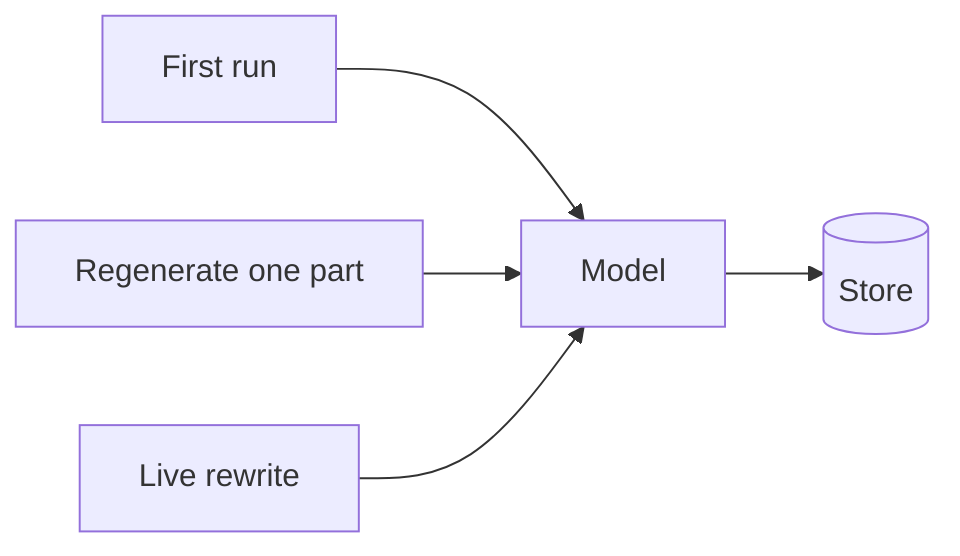
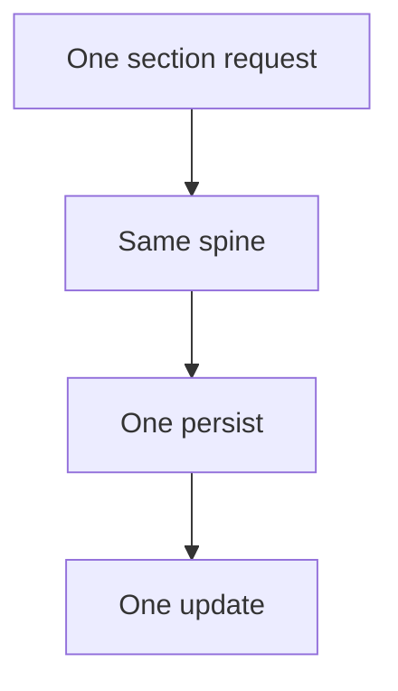

A long-form generated document is not one model call. It is a set of sections, each assembled from context, attachments, and a house voice. The last mile is something a person will send — not a dump of the model.

I lead engineering at [Psynth](https://psynth.ai). I joined as a design engineer. Failure modes, tradeoffs, decisions I would make again. Not a tour of the internals.

No patient content on this page.

## The challenge

The first time you generate a document, you write a function. The second time — regenerate one section, stream a rewrite, run a batch overnight — you copy it. Each copy looks faster than extracting a shared path. After a few months you have several engines that all "call the model and persist."

They are never the same product.

A fix lands in one path. The others keep the old behaviour. First run and regenerate silently disagree on the document shape. A clinician sees a short, plausible section. Nobody notices it is the wrong shape — or a silently cut one.

That is the class of bug I care about. Not "the model was wrong." The system made two truths.

## Think in one spine

If first run and regenerate are allowed to be different functions, they will drift. The interesting question is not "how do we abstract the LLM." It is: **what is the same every time a section is produced?**

Visibility. Context. Prompt. Call. Assemble. Persist. Tell the UI.

The parts that actually differ — this section is a narrative, that one wraps a table, that one is a custom clinic block — should be the only branches. Everything else is one path, including the first run and the nth regenerate.

A flag that says "this is a regenerate" is telemetry. It must not change the content shape. The moment it does, you have two products again.

## Do not ask the model for the editor's document

Rich editors have a native tree: nested nodes, marks, attributes. It is tempting to make the model emit that tree. The schema that is *complete* is usually the schema that structured-output cannot hold — recursion, `$ref`, envelopes that waste tokens.

The thought: **the model fills a small, boring contract. Your code expands it into the editor's tree.** Recursion and grammar live in a mapper you can test. HTML, if you still need it, is derived. If two converters exist, they will disagree. If regenerate re-derives structure from HTML, it will lose information the first run had.

A table is a different object than a paragraph. Forcing both through one nested schema is how you hit a provider grammar limit and start inventing workarounds. Split the call, or keep the table outside the model's document. Do not pretend the model speaks your editor.

## A timeout is not a no-op

Generation is slow. Retries make it slower. If the client gives up while the worker is still running, the work happened. You will then run it again. You pay twice. Only the second run is recorded.

The thought: the timeout in front of a long job must be honest about the job's own budget. Fail fast on *connect*. Wait for *work*. Treat "timed out" as "maybe still running," not as "never started."

The same honesty applies to truncation. If the model stops because it hit a length cap, that is a failure. Repairing it, padding it, or concatenating a retry produces a short section that looks finished. Visible failure is kinder than a quiet amputation.

## Fail at the edge, not in the middle

If a file cannot be read, the worst moment to discover it is halfway through generating the document. Heavy parse work also does not belong on the same workers as the model calls — an OOM there kills generation.

The thought: **do expensive, fallible preparation when the file arrives.** Cache successes. Do not cache failures (they must not poison a later run). Keep the generate path short.

## A live rewrite is not a section generate

Streaming tokens to the screen is a different product operation from "produce a canonical section." Forcing one through the other's contract either kills the stream or doubles the cost.

The thought: pick a **reconciliation point**. For a live rewrite, that point is persist — canonicalize whatever landed, once, when you write. And flush the editor before you send "original content" to the model, or you bake yesterday's keystrokes and overwrite today's.

## What I would not do again

Copy a generator. The first time it looks faster. The third time it is already a different product.

Ask the model for the editor's native tree. The schema that is reliable is smaller than the schema that is complete.

Treat "the call timed out" as "the work did not happen." The work happened. You just paid twice.

Log a slice of the section. That is the document.

## The bar

One spine for first run and regenerate. Structure at the source, not recovered from HTML. Preparation at the edge. Truncation visible. Timeouts that tell the truth. The last mile is still the same: a short, house-voice document someone will send — not a dump of the model.
