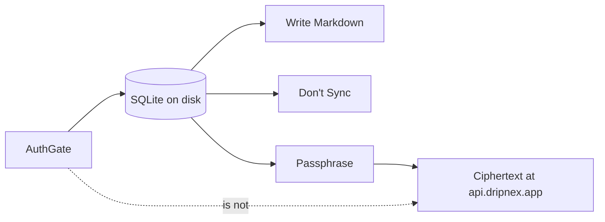

A local-first app that skips login looks kind. Then the first second device has no way to find you, and the first paid seat has no way to name you. A cloud-first app that logs in *and* uploads looks complete. Then the notes left the machine because you typed an email.

[Dripnex](/work/dripnex) splits those jobs. First launch is **AuthGate**. A magic-link email — no password. Sign-up and sign-in are the same flow. Leave the window open, open the link, you are in. After that you can work offline. You do not need sync to write Markdown.

The store is a different decision, written [elsewhere](/writing/sqlite-is-the-store). This is who you are versus where the bytes go.

## The problem

If signing in uploads the notebook, "account" means "their servers have the words." If you refuse an account so the files stay local, you cannot name a license, a second Mac, or a passphrase later without a rewrite.

[Optional sync](https://github.com/dripnex/docs-site/blob/main/content/docs/sync.mdx) is a later switch. Same email on each device. An encryption passphrase under **Set up**. Without that key the server has nothing readable to store. `api.dripnex.app` holds blobs. Plaintext does not leave the machine as part of sync. Where the replica actually runs — not in `@dripnex/sync-core` — is written [elsewhere](/writing/sync-core-is-not-a-sync-engine).

Don't Sync is valid. Notes stay in the application folder. Signing out does not delete them. Footer: Synced, Syncing, Offline, or Error — Error is often a missing passphrase, not a lost notebook.

## One hard decision

**Signing in is not uploading.** AuthGate names you. Don't Sync is a real product path. Ciphertext is opt-in, and only after a passphrase exists.

Retry does nothing until the key exists. That is the honest error. A login that silently starts a replica is a different product.

## What I would not do again

Treat "no login" as the local-first proof. Then the second device has no name, and the store still has to wait.

Treat "signed in" as "the cloud may read this." Then you built a host that holds the words.

## The bar

A notebook you can write after the network drops, and a cloud that cannot read it until you said so. User manual: [docs.dripnex.app/sync](https://docs.dripnex.app/sync). Live at [dripnex.app](https://dripnex.app).
