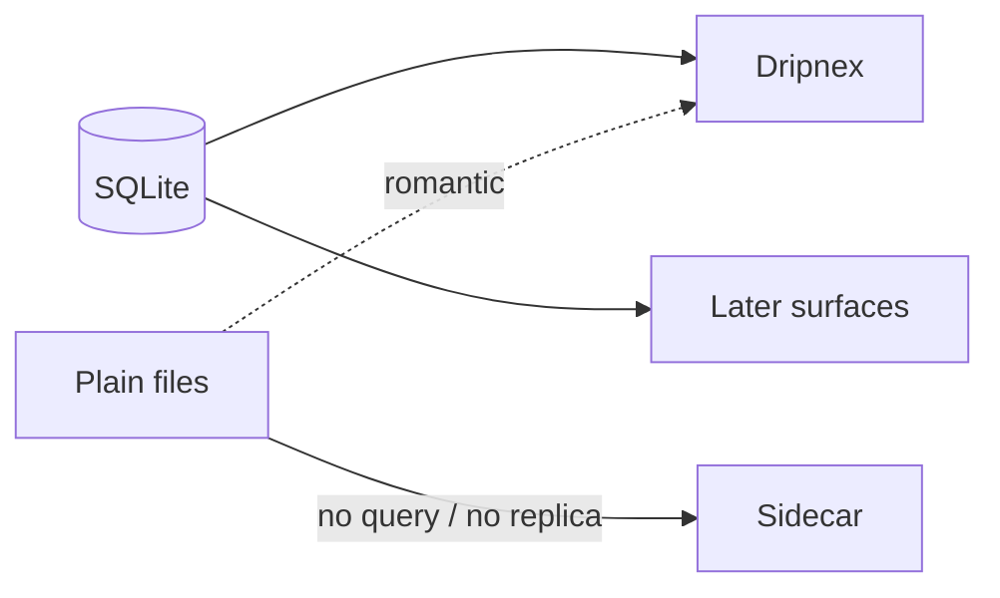

Notes either sit in a vendor cloud or in a folder with no path to other surfaces. Plain Markdown on disk feels honest. It also becomes a migration when you want a phone, a query, or a sync.

[Dripnex](/work/dripnex) is a hackable AI note taker. SQLite on the machine today. Sync when those surfaces ship. The store does not wait on them.

## The problem

A folder of files is a product only while you are the only process. The second you need FTS, attachments, or a replica, you invent a sidecar. Then you have two sources of truth. The file is pretty. The sidecar is what the app believes.

Offline-first often means "we will sync later" with the schema of a cloud. I wanted the opposite: a local database that can sync without a rewrite, and plugins that are git repos you can open — `init.js` — not an extension store that holds the words.

Readied is the other pole: notes stay as plain files. That is a different product. I shipped both. They do not share a store on purpose.

## One hard decision

**SQLite is the source of truth.** Not a cache of files. Not a JSON blob waiting to become Postgres. A local database is what you can replicate later without a migration story from "we were just files."

Packs and plugins stay files — git repos — because that is the hackable surface. The note body can be Markdown. The index, the relations, the AI run, the thing another device needs, live in SQLite.

Don't Sync is valid. Signing in is not uploading. Designing the store around a cloud that might never exist is how you build a cloud with extra steps. Designing the store as if a second surface will never exist is how you trap the words.

## What I would not do again

Treat the folder as the database. The first week it feels native. The first query it feels like a lie.

Hold the notes in a vendor format so "sync is easy." Sync is easy when you own the bytes.

## The bar

A note you can still open when the network is gone, and a store you will not throw away when a second surface ships. Live at [dripnex.app](https://dripnex.app). Core: [github.com/dripnex/readide](https://github.com/dripnex/readide).
