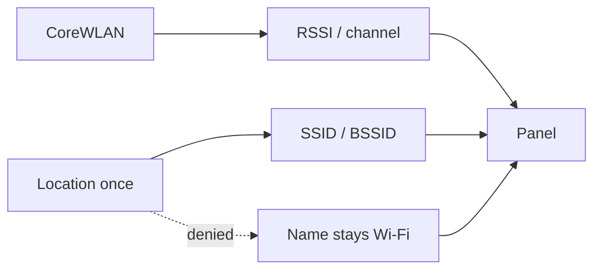

Apple will not give you the network name without a location prompt. A menu bar that asks for Location to show RSSI looks like spyware. A menu bar that never names the network looks unfinished.

[DevWifiBar](/work/devwifi) asks once. The [README](https://github.com/tomymaritano/devwibar/blob/main/README.md) is the contract: CoreWLAN plus CoreLocation for SSID / BSSID. Without the grant, the panel still shows RSSI, IP, traffic, DNS, and latency. The name stays “Wi-Fi”.

What fills the pipe is a different decision — process names and hosts, nothing inside TLS — written [elsewhere](/writing/the-radio-is-fine).

## The problem

If Location is required for the radar, you will not ship the radar. If you hide the prompt by scraping the SSID some other way, you have a private API and a review you will fail. If you refuse Location entirely, every network is anonymous and the panel cannot say which one you are on.

lsof and nettop still run. The catalog still names Cursor Helper and `api.anthropic.com`. Those are not Location. System Settings → Privacy & Security → Location Services → DevWifiBar.

## One hard decision

**SSID is a location permission. The radar is not.** Ask once. Degrade the *name*, not the evidence.

The bar is still an `LSUIElement`. No Dock. Traffic, ping, and the three chips do not wait on a map.

## What I would not do again

Gate the whole panel on Location because the SSID is the first label in the mock. RSSI does not need a street.

Scrape the network name to skip the prompt. That is a different product, and Apple will treat it as one.

## The bar

A panel that still tells you why the ping moved when the network is anonymous. [github.com/tomymaritano/devwibar](https://github.com/tomymaritano/devwibar) · `brew tap tomymaritano/tap && brew install --cask devwibar`.
