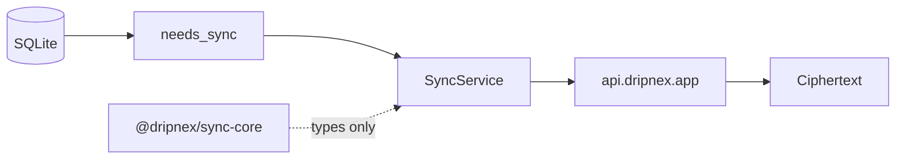

A `sync-core` package that replicates looks complete. Then a contract is a replica, and a Node test is Cloudflare. Putting the engine in a shared package looks honest. Then the desktop, the API, and a future phone each invent a second replica, and they disagree on last-write-wins.

[Dripnex](/work/dripnex) keeps the name boring. The [storage page](https://github.com/dripnex/docs-site/blob/main/content/docs/architecture/storage.mdx) is the contract: `@dripnex/sync-core` is **not a sync engine**. Shared TypeScript types and `validateNotebookTree`. Live sync is `SyncService` in the desktop. It talks to `packages/api` on Cloudflare. The server stores ciphertext.

Signing in is [not uploading](/writing/signing-in-is-not-uploading). SQLite is [the store](/writing/sqlite-is-the-store). This is where the replica is allowed to run.

## The problem

If `sync-core` pushes blobs, every consumer is an Electron rebuild away from a replica. If the API owns last-write-wins, the machine is not the source of truth. If you drop in Supabase because "sync is a product," you built a host that holds the words.

Every write goes to SQLite first. Triggers mark `needs_sync` on content changes. `SyncService` encrypts and pushes blobs. Pull decrypts locally. Conflicts are last-write-wins with a local CEK. There is no Supabase in this stack.

Don't Sync is still valid. The package does not change that. A type you can import is not a replica you did not ask for.

## One hard decision

**sync-core is not a sync engine.** Contracts and `validateNotebookTree`. Live sync is `SyncService` on the desktop. Do not put the replica in a shared package so "every surface can sync."

If a type pushes a blob, it is not this package.

## What I would not do again

Ship a generic sync engine in `packages/` so iOS can "just import it." Then two replicas, and the second one is where the bug lives.

Stand up Supabase because the types looked like a backend. Then the server has the words, and Don't Sync is a lie.

## The bar

Types you can test in Node, and a replica that only runs after a passphrase. Internals: [storage](https://github.com/dripnex/docs-site/blob/main/content/docs/architecture/storage.mdx). User manual: [docs.dripnex.app/sync](https://docs.dripnex.app/sync). Live at [dripnex.app](https://dripnex.app).
