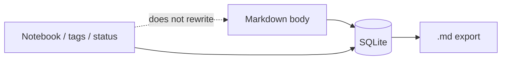

A notebook app that writes tags into the file looks portable. Then renaming a tag rewrites every note. A heading that names the notebook looks honest. Then moving a note is an edit.

[Dripnex](/work/dripnex) keeps those jobs apart. The [organizing page](https://github.com/dripnex/docs-site/blob/main/content/docs/organizing-notes.mdx) is the contract: notebooks, tags, status, pin, trash, and archive live beside the Markdown. They do not rewrite it.

What you persist as the words is a different decision, written [elsewhere](/writing/the-file-is-the-export). The store is a different decision too — [SQLite, not a folder](/writing/sqlite-is-the-store). This is the sidebar.

## The problem

If a tag is a string in the body, organization is a search-and-replace. If the notebook is a folder on disk, a move is a path change and a sync fight. If status is a heading the parser looks for, completing a note is rewriting the note.

The sidebar is a notebook tree. Notes belong to a notebook. You can move one. Click a notebook to focus it; <kbd>Escape</kbd> or the breadcrumb home returns to All Notes. Settings → General sets the default used when you create a note from All Notes. Collapsed notebooks list notes from their descendants. Expanded notebooks show their own.

Tags attach. Status is a word: active, on hold, completed, dropped. Pin keeps a note at hand. Trash is soft-delete, restore, or delete forever. Archive hides a note from the default lists without deleting it.

Those fields are organizational. Export is a copy of the stored string. Import is a Markdown folder. The first-run welcome mentions other apps. It does not turn their metadata into headings.

Local data sits in one application folder — `~/Library/Application Support/Dripnex/` on macOS, `%APPDATA%\Dripnex\` on Windows, `~/.config/Dripnex/` on Linux. Overrides if you need them: `DRIPNEX_DATA_DIR`, or `--user-data-dir`. Don't Sync means they stay here.

## One hard decision

**Tags are not the body.** Notebooks, status, and pin live in the store. The Markdown is still what you typed.

A rename must not be a rewrite. A move must not be an edit. Completing a note must not insert a heading the next export has to explain.

## What I would not do again

Encode tags as hashtags in the file so "it's portable." Then a rename is a rewrite, and a typo is a second tag.

Put the notebook name in a heading so the sidebar can parse it. Then moving a note is editing, and two parsers will disagree.

## The bar

A sidebar you can rearrange without changing the words, and an export that is still the string you typed. Docs: [organizing notes](https://github.com/dripnex/docs-site/blob/main/content/docs/organizing-notes.mdx). Live at [dripnex.app](https://dripnex.app).
