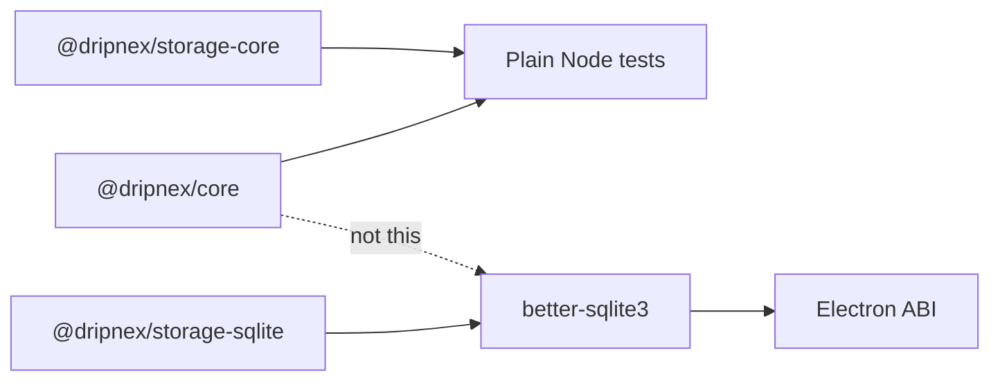

A single storage package that imports `better-sqlite3` looks simpler. Then core tests rebuild native for every Electron ABI, and a note operation is a compile. Putting SQLite in `@dripnex/core` looks honest. Then a domain test is a `.node` file, and CI is an Electron version.

[Dripnex](/work/dripnex) keeps native in one place. The [storage page](https://github.com/dripnex/docs-site/blob/main/content/docs/architecture/storage.mdx) is the contract: split so native dependencies stay in one package. `better-sqlite3` must be rebuilt per Electron ABI. Isolate it. Storage-core and core tests run in plain Node.

The write port is [not the index](/writing/the-write-port-is-not-the-index). The renderer never [sees SQL](/writing/the-renderer-never-sees-sql). This is which package is allowed to be native.

## The problem

If `@dripnex/core` loads `better-sqlite3`, `pnpm --filter @dripnex/core test` is an ABI. If storage-core links native, migrations cannot be typed without a rebuild. If the desktop vendor copies SQLite into three packages, you have three ABIs.

`@dripnex/storage-core` has no native deps: `DatabaseAdapter`, `ExtendedNoteRepository`, `Migration` types and runner, `DataPaths`, backup. `@dripnex/storage-sqlite` is the `better-sqlite3` adapter: `SQLiteNoteRepository`, notebooks, chunks, embeddings, forward-only migrations (through `019_embeddings`). It is the **only** package with native deps.

## One hard decision

**The ABI is not the domain.** `better-sqlite3` lives in `@dripnex/storage-sqlite`. Core and storage-core stay rebuild-free. Do not import native so "it's one package."

If a domain test needs an Electron rebuild, it is not this core.

## What I would not do again

Vendor `better-sqlite3` next to `createNote` so "the operation can just save." Then a title change is an ABI, and CI is a native toolchain.

Share the native addon across packages because "we already compiled it." Then two ABIs disagree, and the desktop is the test.

## The bar

Core tests in plain Node, and one package you rebuild when Electron moves. Internals: [storage](https://github.com/dripnex/docs-site/blob/main/content/docs/architecture/storage.mdx). Live at [dripnex.app](https://dripnex.app).
