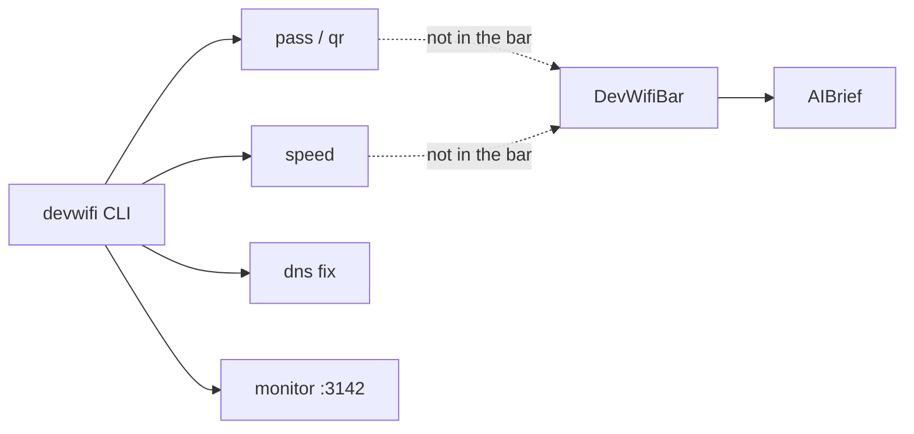

A menu bar that reveals the password looks complete. Then the always-on radar is a keychain UI, and Location plus `security` live in one popover. Folding `devwifi doctor` into the bar looks honest. Then diagnose waits on Cloudflare, and `AIBrief` is not a function you can test.

[DevWifiBar](/work/devwifi) keeps the toolkit in the other repo. The [bar README](https://github.com/tomymaritano/devwibar/blob/main/README.md) is the contract: password reveal, QR share, speed test, DNS switching, device scan, and alerts stay in the [`devwifi`](https://github.com/tomymaritano/devwifi) CLI. **The bar is not the CLI.** Radar in the bar. `pass`, `qr`, `speed` in the toolkit.

What fills the pipe is written [elsewhere](/writing/the-radio-is-fine). The widget is [not a radar](/writing/the-widget-is-not-a-radar). This is which surface is allowed to hold a password.

## The problem

If the popover runs `devwifi pass`, the radar needs admin and the keychain. If it runs `devwifi speed`, the verdict waits on a download. If you fold `devwifi monitor` into the status item, the bar is a dashboard on `:3142`, and native Swift was a costume.

The [CLI README](https://github.com/tomymaritano/devwifi/blob/main/README.md) is a list of jobs, not a second radar: `pass`, `qr`, `list`, `signal`, `speed`, `dns`, `dns fix`, `doctor`. `watch` is a terminal sparkline. `monitor` (alias `ui`) is a dashboard at `http://localhost:3142` with history in `~/.devwifi/history.json`. Devices and alerts live there. QR is `WIFI:T:WPA;S:<ssid>;P:<password>;;`. Speed tests use Cloudflare. `pass`, `qr`, and `dns fix` need administrator. Node, cross-platform. `npm install -g devwifi`.

The bar is Swift, macOS 14+, `brew install --cask devwibar`. No Dock. No keychain. Same RSSI cutoffs as `devwifi signal`. The verdict does not call Cloudflare.

## One hard decision

**The bar is not the CLI.** Radar in the bar. `pass`, `qr`, `speed` stay in the toolkit. Do not put the keychain in an always-visible popover. Do not make diagnose wait on a speed test.

If the status item can print the Wi-Fi password, it is not this bar.

## What I would not do again

Ship `devwifi pass` in the popover because "the CLI already has it." Then Location and the keychain share a window, and the radar is a password manager.

Put `devwifi speed` in the bar so ping has a number. Then `AIBrief.diagnose` waits on Cloudflare, and the unit test is a network.

## The bar

A verdict you can read without a password, and a toolkit you invoke on purpose. CLI: [github.com/tomymaritano/devwifi](https://github.com/tomymaritano/devwifi). Bar: [github.com/tomymaritano/devwibar](https://github.com/tomymaritano/devwibar).
