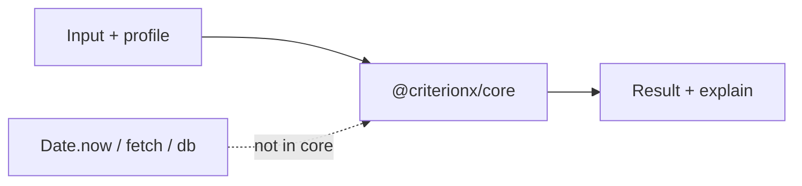

A decision that reads the clock looks live. Then the test is a freeze, and yesterday's input is not today's output. A `fetch` inside `when` looks complete. Then the engine is a client, and *why* includes a network.

[Criterion](/work/criterionx) keeps I/O out of `@criterionx/core`. The [README](https://github.com/tomymaritano/criterionx/blob/main/README.md) is the contract: pure engine, no I/O, no database, no external calls. Same input, same output.

What *why* is is written [elsewhere](/writing/if-you-cannot-show-why). Profiles are [not a fork](/writing/a-profile-is-not-a-fork). Packages are [not a platform](/writing/packages-are-not-a-platform). This is what the function is allowed to touch.

## The problem

If `when` can `Date.now()`, a replay is a different day. If `emit` can fetch, a timeout is a new result. If the core can see a database, you cannot test it without standing one up — and you cannot send a reason that will match next week.

Side effects live outside. Express, tRPC, the HTTP server, OpenTelemetry — those packages call the engine. The engine does not call them. Pass the object. Assert the object. Read the explanation.

If it needs a clock it is not this engine. If the business cares about a time, that time belongs on the input object. Then it is data, and the test is still a function.

## One hard decision

**The core has no clock.** No fetch, no database, no `Date.now`. Pass the object. Do not hide I/O in `when`.

A helper that "just reads config" is I/O. A retry inside `emit` is a second product.

## What I would not do again

Call `Date.now()` so the rule can expire. Then the same payload is two decisions, and the audit trail is a timestamp you cannot replay.

Put Postgres in the core so "it's one round trip." Then the test suite is a database, and the reason includes a row that moved.

## The bar

A function you can run in a unit test with no network, and a reason that still matches next week. Docs: [tomymaritano.github.io/criterionx](https://tomymaritano.github.io/criterionx/). Core: [github.com/tomymaritano/criterionx](https://github.com/tomymaritano/criterionx).
