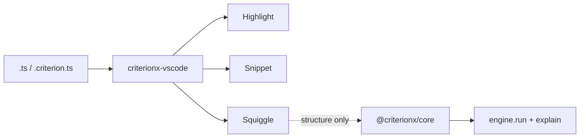

A language server that evaluates the rule looks complete. Then the IDE is the engine, and *why* is a diagnostic that will not match next week. A dedicated Criterion language looks honest. Then `when` is not a function, and TypeScript is a second product.

[Criterion](/work/criterionx) keeps the editor boring. The [vscode-extension README](https://github.com/tomymaritano/criterionx/blob/main/packages/vscode-extension/README.md) is the contract: syntax highlighting, snippets, and validation. **The editor is not the engine.** `criterionx-vscode` does not import `@criterionx/core`.

Packages are [not a platform](/writing/packages-are-not-a-platform). What *why* is is written [elsewhere](/writing/if-you-cannot-show-why). A scaffold is [not a decision](/writing/a-scaffold-is-not-a-decision). This is how the IDE is allowed to touch a decision.

## The problem

If the hover runs `engine.run()`, a squiggle is a fake audit trail. If the file is a new language, `when` waits on a grammar instead of a function. If validation lives in core so "the editor can share it," the knife has vscode types.

The file is still TypeScript. Language id `criterion` for `.criterion.ts`. The grammar injects into `source.ts` and `source.tsx`. Activation is `onLanguage:typescript`. A file counts if the name ends in `.criterion.ts`, or if a `.ts` file contains `defineDecision` or `@criterionx/core`.

Validation is a list, not a replica: missing `id`, `version`, `inputSchema`, `outputSchema`, `profileSchema`. Empty `rules` is a warning. A rule missing `when`, `emit`, or `explain` is an error. The checks are string scans extracted from `extension.ts` so they test in Vitest without a window. Hover documents the keywords. **Criterion: New Decision** writes `name.criterion.ts` from a template. `criterion.validate` defaults on. `criterion.trace` defaults off.

None of that is `engine.run`.

## One hard decision

**The editor is not the engine.** Highlight, snippet, squiggle the object. Do not import core. Do not evaluate the rule in the diagnostic.

If a hover returns a risk score, it is not this extension. If the file is not TypeScript, it is not this language.

## What I would not do again

Ship a language server that calls `engine.run` so "you see *why* while you type." Then the squiggle is a reason you cannot replay, and the IDE has a clock.

Put vscode types in `@criterionx/core` so "the editor shares the validator." Then the knife has a window, and the unit test is an extension host.

## The bar

A missing `explain` you can see without running the rule, and a reason that still comes from the function. Package: [packages/vscode-extension](https://github.com/tomymaritano/criterionx/tree/main/packages/vscode-extension). Docs: [tomymaritano.github.io/criterionx](https://tomymaritano.github.io/criterionx/). Core: [github.com/tomymaritano/criterionx](https://github.com/tomymaritano/criterionx).
