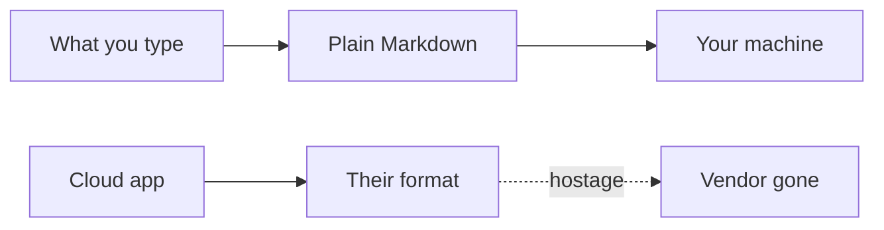

Note apps hold the words hostage: a proprietary format, a connection, a vendor that might disappear.

[Readied](/work/readied) is an offline-first Markdown editor. What you type is what gets saved. No hidden transforms. The file has to stay readable if the app goes away. Live at [readied.app](https://readied.app).

## The problem

Cloud note apps phone home. Offline is a cache of their server. When the vendor goes, so do the notes.

I wanted the opposite: you write, the app saves, a `.md` file sits on disk. No internet required. Open it with any editor.

[Dripnex](/work/dripnex) is the other pole — SQLite as the store so notes can sync later. Readied does not share that store on purpose. Files are the product here.

## One hard decision

**Local-first is the product, not a feature.** Sync can wait. macOS first. Plugins optional. The markdown is never auto-modified.

CodeMirror 6. Local storage. Open source. The bytes on disk are the note, not a dump of a richer document.

## What I would not do again

Ship "export" as the way you get your words back. Export is a feature of a hostage.

Treat Markdown as a cache of a richer document. Then you have two truths, and the file is the lie.

## The bar

A note you can open when the network is gone, and a file you can open when the app is gone. [readied.app](https://readied.app).
