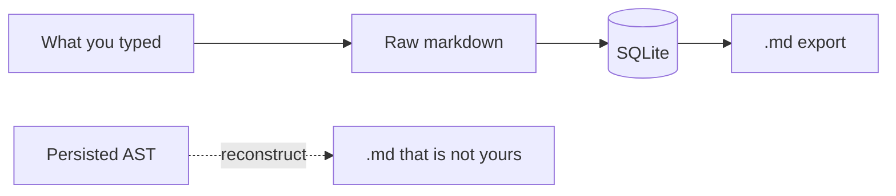

A files-first editor treats a folder as the product. A block editor treats a tree as the product. Both reconstruct the words on the way out.

[Dripnex](/work/dripnex) is not a files-first Markdown editor. Notes live in local SQLite. `.md` is export, not identity. The [content contract](https://github.com/dripnex/docs-site/blob/main/content/docs/decisions/adr-002-markdown-model.mdx) is the raw string you typed.

The store is a different decision, written [elsewhere](/writing/sqlite-is-the-store). [Readied](/work/readied) is the other pole: the file on disk *is* the note. They do not share a store on purpose.

## The problem

If the AST is what you persist, export is a serialization. Whitespace dies. A list marker changes. A parse error becomes a data-loss event. A hybrid — keep the string *and* the tree — asks which one wins when they disagree.

Parse has to be allowed to fail. Save still has to happen. Features that need a title, tags, or a word count derive them on write. They do not get to rewrite the body.

Packs stay optional chrome. Uninstall and the notes still read. A satellite must not invent syntax other tools cannot open, and it must not mutate a note unless you asked — an explicit command, not a formatter with opinions.

## One hard decision

**Markdown text is canonical. The AST is ephemeral.** Never auto-modify what the user typed. Never reconstruct markdown from a tree. Export is an exact copy of the stored string.

The app can parse on demand. It cannot prettify. It cannot "fix" a broken link. It cannot normalize headings because the preview looked nicer. If you typed two spaces, they stay.

`.md` is how you take the words out. It is not how the app finds them tomorrow.

## What I would not do again

Persist the AST because features are easier on a tree. Reconstruction is a different document.

Keep both the string and the tree "in sync." That is two sources of truth and a fight about which one is lying.

Treat export as a feature of a richer document. Then the file is a reconstruction, and the reconstruction is the product.

## The bar

A note that still reads as what you typed, and an export that is not a reconstruction. ADR-002 in [dripnex/docs-site](https://github.com/dripnex/docs-site/blob/main/content/docs/decisions/adr-002-markdown-model.mdx). Pack SDK: [developers.dripnex.app](https://developers.dripnex.app). Live at [dripnex.app](https://dripnex.app).
