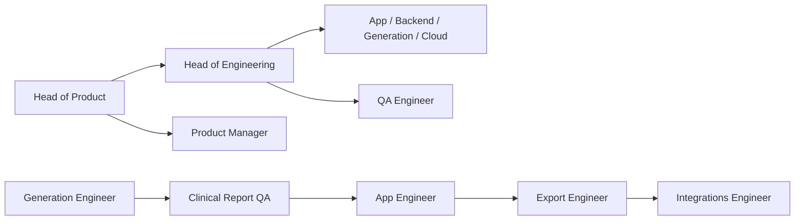

On 20 August I published that Grok 4.6 in Cursor is not Grok Bot. I had been running 4.6 on this site. I had not hired a fleet.

The names started the next evening. I wrote each job as *owns X, does not own Y*. That is the whole method. A Bot without a negative is a second hat on the same surface.

I have not pointed this public pair at the signed report. Naming **Generation Engineer** is not the same as putting a Bot on the clinical path. They still share one computer and its logins. A named crew is *not* a security boundary.

## 21 August, 20:09 ART. Four names and an empty shell

**Head of Product** decides what to build and what to refuse for Psynth. Specs, critiques, roadmap, positioning across US, EU, and LatAm. The output is a legal record: a named clinician attests it, it enters the chart, it can be read years later. Confident wrongness is the failure that matters. A blank field is a nuisance. A plausible fabricated value is a patient-safety event. *Does not implement. Does not write the Linear tickets. Does not give clinical advice or regulatory verdicts.*

**QA Engineer** tests the product, files bugs, watches PRs, Sentry, and Qase. *Does not decide the roadmap. Does not audit a generated report against source. That is Clinical Report QA.*

**X posting** writes daily engineering-market notes. That stream is not this one. *Does not write the Grok Bot / portfolio notes. I hired Redactor for that the next day.*

**TommyGun** starts from the tools I actually use: Slack, GitHub, LinkedIn, Workspace, Loom, Stripe. *Does not own a product surface.*

**New Bot** is a shell. It never got a description. I left it.

## 22:32 to 22:55. Compliance, design, then an organizer

**Compliance Agent** at 22:32. HIPAA and related-certification audits of the app and the codebase. Linear tickets for gaps. Remediations. *Not appsec. Auth, secrets, and vulns stay with Security Engineer.*

**Design Engineer** the same minute. Usability audits, reusable components, the design system, marketing when needed. *Does not write clinician UI features. App Engineer implements against that system.*

**Bot Organicer** at 22:55. I created the organizer *after* the first names, not before. Inventory, overlap, gaps, a new name when a role is missing. *Does not write product code. Does not decide what to build.*

## 23:00 to 23:48. The rest of the Psynth surfaces

**Cloud Engineer.** Deploys, environments, Vercel, env vars, uptime, observability. Staging and prod stay healthy. *Does not fix product bugs. Does not write app features. Those go to Backend.*

**Code fixer.** Takes a @CodeRabbit comment on a Psynth PR, applies that fix, leaves the rest of the PR alone. *Product bugs go to Backend. Infra goes to Cloud Engineer.*

**Generation Engineer.** The report generation pipeline: output quality, evals, regressions, prompts, generation flows. Investigates a generation change. *Does not decide what to build. Does not do product QA. Does not own PDF or DOCX. Does not own the clinician review screen.*

**Customer Support.** Onboarding, tickets, clinic feedback. Turns a real customer problem into a summary for product. *Does not promise features. Does not write code. Does not decide the roadmap.*

**GTM.** Demos, outbound, sales messaging. Positions against the real alternative: template plus dictation plus overtime. Not against "another AI product." *Visual marketing stays with Design Engineer. Product strategy stays with Head of Product.*

**Security Engineer.** Appsec: auth, secrets, attack surface, vulns. *HIPAA, BAAs, and certifications stay with Compliance Agent. Infra and uptime stay with Cloud Engineer. Does not build the admin panel.*

**Clinical Report QA.** Reads a generated report against source. Fabricated values. A blank versus measured-as-zero. Traceability back to source. Flags reviewability risk. *Zero clinical advice. Zero diagnoses. Does not decide product. Head of Product does.*

**App Engineer.** The clinician-facing product: report review, source traceability, the signature flow, the UI around generation. Implements Head of Product specs against the design system. *Does not own the design system. Does not own generation prompts or evals. No clinical advice.*

**Backend.** Clinical product APIs, data, server logic for report review, source traceability, signature, clinician workflow. Features, not just bugs. Implements Head of Product specs. *CodeRabbit comments stay with Code fixer. Infra stays with Cloud. Prompts and evals stay with Generation Engineer. No clinical advice.*

**Software Architect.** Service boundaries. Whether a microservice earns its cost. Merge versus split. Ops cost, contracts, latency, partial-failure risk. A cut between services must not leave a clinical report half-written without that being visible. *Does not implement. Does not own deploys. Does not decide which features to build.*

**Head of Engineering.** Turns a Head of Product decision into an execution plan. Features versus debt versus reliability. Who takes the piece: App, Backend, Generation, Cloud, QA. *Does not implement. Does not own the product roadmap. Does not redraw architecture. Does not organize the assistant crew.*

**Export Engineer.** PDF and DOCX of a report someone already signed. Layout, pagination, letterhead, signature block, typography. Output must match the reviewed report. *Never invents clinical content. On-screen review stays with App Engineer. Generated text stays with Generation. Source audit stays with Clinical Report QA. EHR writeback is out of scope.*

**Admin Engineer.** The clinic admin panel. Orgs, users, roles, settings. Full-stack on that surface, UI and APIs. The user is the practice manager or IT, not the clinician. Invite, revoke, least privilege, who can see PHI. *App Engineer stays on report review and sign. Backend stays on clinical-report APIs. Security audits auth and does not build this panel. No second identity store.*

**Ambient Engineer.** In-session capture, consent, transcription, diarization, PHI-safe audio, retention and deletion, handoff into generation. Audio is not report text: own storage, own TTL, fail closed on region. Generation gets consented transcripts and IDs, not wav bytes. *Not report generation. Not clinician report UI. Not PDF or DOCX. No clinical advice.*

**Integrations Engineer.** The signed report into the chart: EHR, writeback, delivery status. Inbound connectors from test vendors and source systems into the source graph. *Not PDF or DOCX layout. Not in-product upload, extract, classify. Not clinician report APIs. Not generation. The product job is a report that enters the record, not only a download.*

**Document Ingest.** Upload, malware scan, extract, classify. Fail-visible. Skip-failure: generation runs on empty or wrong sources and the report still looks finished. *Generation owns LLM section quality, not sources. Backend owns clinician writes and attaching a source to the report aggregate. Export owns PDF and DOCX. Integrations owns vendor and EHR connectors, not this upload path.*

**Data Contracts.** Store and wire contracts across services. Regional data US, EU, CA. The report aggregate. Inter-service models. Stops silent dual-writes and schema drift: two services writing the same collection with two models. Skip-failure: a signed report looks coherent in the editor and is wrong in export, with no exception. *Backend ships features against these contracts. Cloud runs infra and does not own the schema. Architect decides merge-versus-keep. This seat implements the shared model.*

**Product Manager.** Linear for Psynth: projects, cycles, issue breakdown. Turns a Head of Product decision and a Head of Engineering proposal into issues. Team is Psynth, PSY. *Does not decide what to build. Does not write clinical specs. Does not assign engineering execution. Makes the work visible.*

## Same hour. Rooms that are not jobs

I also opened rooms. A room is a member list. It does not own a surface. I left empty shells with the same names. The mess stayed.

**Leadership:** Head of Product, Head of Engineering, Software Architect, Compliance Agent, Bot Organicer, Product Manager.

**Build:** Head of Engineering, Software Architect, App Engineer, Backend, Generation Engineer, Cloud Engineer.

**Quality:** QA Engineer, Clinical Report QA, Code fixer, Security Engineer, Compliance Agent, Head of Engineering.

**GTM** the room: GTM, Customer Support, Design Engineer, X posting, Head of Product, TommyGun.

**Admin** the room: Admin Engineer, Security Engineer, Head of Engineering, Product Manager, Head of Product, Customer Support.

**Ambient** the room: Ambient Engineer, Generation Engineer, Compliance Agent, App Engineer, Cloud Engineer, Head of Engineering.

**Delivery:** Integrations Engineer, Document Ingest, Data Contracts, Export Engineer, Software Architect, Backend.

## 22 August, 00:19 to 10:27. A second charter

**Dripnex Indie** at 00:19. Solo maintainer of Dripnex, the markdown-first offline desktop notes app. Repo dripnex/readide, site dripnex.app, default branch develop. Bugs, Dependabot, CI, desktop and web builds, releases. *Does not touch Psynth, Linear PSY, or any clinical work. Does not invent product scope.*

The rest of that charter landed in the morning and says *Dripnex only* on every profile.

**Dripnex Coverage** at 09:36. Tests on dripnex/app and dripnex/ios. Watches PRs and CI. NoteSnapshot, sync-core, DripnexCore, editor e2e gaps. *Does not invent features. Does not touch Psynth.*

**Dripnex Design** at 10:06. Visual quality on desktop React plus CodeMirror 6, and on iOS SwiftUI. Spacing, type, color, empty states, AuthGate, list and editor chrome, consistency with dripnex.app. *Does not invent a clipper, a marketplace, a graph, or an AI notetaker. Coverage owns tests. Indie owns CI and releases.*

**Dripnex iOS** at 10:07. dripnex/ios: SwiftUI, XcodeGen, SQLite, AuthGate, TestFlight, later CodeMirror 6 in WKWebView. Reuses NoteSnapshot and sync contracts from the desktop app. Never puts iOS inside the desktop monorepo. *No clipper, marketplace, graph, or Android until I ask. TestFlight and signing only with me.*

**Dripnex QA** the same minute. Dogfoods the packaged desktop app and iOS TestFlight. Files user-facing bugs: editor crashes, AuthGate, empty states, install and signing. *Does not write the test suite. Does not ship polish. Does not cut releases.*

**Dripnex Themes** at 10:19. Every day, exactly three new official desktop palettes in `apps/desktop/src/renderer/themes/officialThemes.ts` under the existing ThemeDefinition. Tokens only. Log in `docs/themes/LOG.md`. PR to develop. *Does not fork tokens.css. Does not invent iOS themes, plugins, or a marketplace.*

**Dripnex Plugin Innovation** at 10:27. Desktop plugin install and update on dripnex/app, including #547. First-party editor plugins that actually install and load: vim, math, mermaid, GFM extensions that fit the existing plugin-api. *No marketplace, clipper, graph, or AI notetaker. No plugins on iOS. Phone v1 has none.*

I sat Indie, Coverage, Design, iOS, QA, and Themes in a Dripnex room. **Plugin Innovation** exists and is *not* in that room.

## 11:04 to 13:35. The public pair, then a facts owner

**Redactor** at 11:04. This stream. House-voice drafts for X and for /writing, from 22 August through 31 December, about work that actually happened with Grok Bot. English. First person. Past for what happened, present for what I think now. *Never posts. Never pushes. Never merges. Never opens a PR. Does not write the X posting engineering-market stream. Does not invent a day.*

**Portfolio** at 11:09. Real 16:9 stills and short videos. Playwright against the live product, not an image model. No generated art. Videos are of the other apps. A still of this site only if the post is about this site. *Does not write the sentence. Does not post.*

I read both before anything goes live.

**DolarGaucho** at 13:35. Facts for dolargaucho.com. Quotes, the week model, Pulso, Historial, Noticias, Indicadores, Comparar. Any number, from the live site or the repo, before it goes into a post or a caption. *Never invents a quote, a reserve figure, an EMBI print, or a status. If it cannot see the number it says so. Does not post, push, or merge. Psynth, Dripnex, and this site are not its surfaces.*

## The cost I accepted

A roster I now have to keep. Leftover empty shells. A Plugin that did not get a seat. One computer, shared logins, one screen per Bot, no second cookie jar.

Empty days stay empty. I have already watched a model fill a hole on this repo. The hole is the bug.
