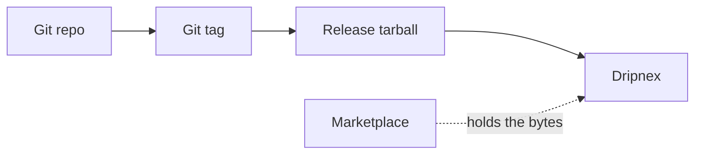

A plugin marketplace is a second product: accounts, review, a host that holds the bytes. [Dripnex](/work/dripnex) is a hackable AI note taker. The hackable surface is git.

[Stamp](https://github.com/dripnex/plugin-stamp) inserts a date. [Mermaid](https://github.com/dripnex/plugin-mermaid) inserts a fence. [Vim](https://github.com/dripnex/plugin-vim) maps `jj` to escape. Each is a **separate git repo**. Version is the git tag. The installable artifact is the tarball on the GitHub release.

## The problem

An extension store looks faster than telling someone to clone. After a year the store is the product. The notes live there too, if you are not careful.

Official themes stay empty on purpose. There is no public marketplace. Preview SVG for diagrams ships with the desktop app. The mermaid repo is the installable community surface — Inkdrop-shaped: one plugin, one git repo.



Install is a slug: `dripnex/plugin-stamp`. Or a pin: `dripnex-plugin install dripnex/plugin-stamp@v0.1.0`. Settings → Plugins → Connect. Reload.

## One hard decision

**One plugin, one git repo.** Not a zip in a vendor CDN. Not an account that licenses a pack.

The host provides `@codemirror/*` and `react`. How a pack injects without forking the editor is written [elsewhere](/writing/an-extension-is-not-a-fork). `init.js` is how you map keys after enable:

```js
const Vim = dripnex.vim;
if (Vim) {
  Vim.map("jj", "<Esc>", "insert");
}
```

The note body can be Markdown. The plugin is code you can open. The store of the notes is still SQLite — that is a different decision, written [elsewhere](/writing/sqlite-is-the-store).

## What I would not do again

Ship a marketplace because "community needs discovery." Discovery is GitHub. The tarball is the artifact.

Put plugins in the same repo as the app. Then a date stamp waits on a desktop release.

## The bar

A plugin you can fork, tag, and install without an account in someone else's store. Core: [github.com/dripnex/app](https://github.com/dripnex/app). Live at [dripnex.app](https://dripnex.app).
