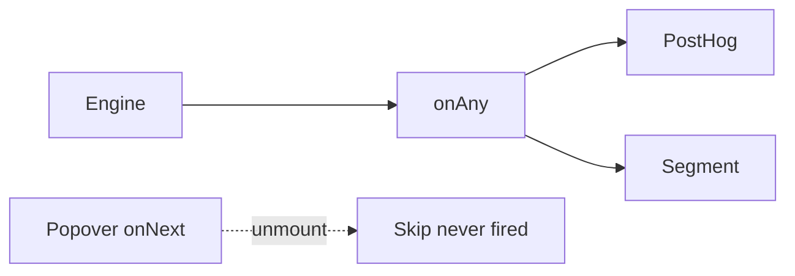

A `onNext` callback on the tooltip looks enough. Then PostHog is a second firehose, Segment is a third, and skip never fires because the popover unmounted. A tour library that "has analytics" looks complete. Then the event is a string you remembered to type, and two steps disagree on the name.

[Cairn](/work/cairn) keeps the firehose on the engine. The [README](https://github.com/tomymaritano/cairn/blob/main/README.md) is the contract: every transition is a typed event. Pipe `onAny` to PostHog, Segment, anything. The popover does not own the tracker.

What owns the UI is written [elsewhere](/writing/engine-is-not-the-renderer). Persistence is [not a restart](/writing/a-reload-is-not-a-restart). This is what you can send.

## The problem

If the spotlight fires `analytics.track("step")`, skip is a hole and dismiss is a guess. If each adapter invents event names, the dashboard is three products. If the callback lives in the React tree, a route change drops the last `step:exit`.



The list is boring on purpose: `flow:start`, `step:enter`, `step:exit`, `flow:complete`, `flow:skip`, `flow:dismiss`, `context:update`. Pipe it:

```ts
engine.onAny((event) => {
  analytics.track(event.type, {
    flowId: event.flowId,
    step: event.state.currentStepId,
  });
});
```

The engine already has `FlowEngine`. React is a binding. The event stream does not wait on `cairn-ui`.

## One hard decision

**The popover is not the firehose.** Typed events on the engine. Pipe `onAny`. Do not invent a second tracker in the overlay.

If skip does not emit, it is not this engine.

## What I would not do again

Bolt Segment onto `CairnPopover` so "analytics is UI." Then a custom renderer has no events, and skip is a missing row.

Name the events in the app so they "match the brand." Then two flows disagree on `step:enter`, and the dashboard is a translation layer.

## The bar

A skip you can see in PostHog without opening the overlay. Docs: [react-cairn.vercel.app](https://react-cairn.vercel.app). Core: [github.com/tomymaritano/cairn](https://github.com/tomymaritano/cairn).
