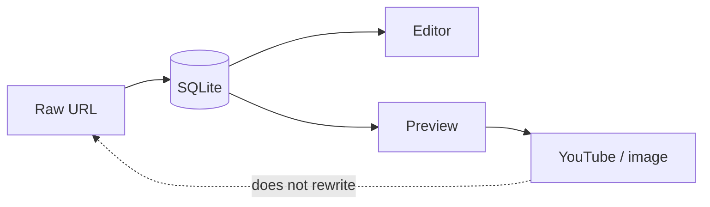

A notes app that pastes an iframe looks rich. Then export is HTML, and another editor cannot open the link. A preview that rewrites the body looks helpful. Then the words you typed are a cache of a player.

[Dripnex](/work/dripnex) keeps the URL in the editor. [`@dripnex/embeds`](https://github.com/dripnex/docs-site/blob/main/content/docs/architecture/editor.mdx) resolves known patterns — YouTube, images — while you preview. The editor still shows the raw URL. Resolution happens in preview, not as a rewrite of the note.

What you persist as the string is a different decision, written [elsewhere](/writing/the-file-is-the-export). Wikilinks and checkboxes are the same family: [the graph is derived](/writing/a-backlink-is-not-a-copy), [the box is the Markdown](/writing/a-checkbox-is-not-a-row). This is the player.

## The problem

If the note stores embed HTML, export is a page, not Markdown. If the editor replaces the URL with a widget, copy-paste is a screenshot. If preview is allowed to write the body, two opens of the same note can disagree after a provider change.

`@dripnex/embeds` recognizes URL patterns and returns embed *type* so the renderer can show a rich preview instead of a plain link. The characters in `content` stay the URL. Turn the plugin off: the note is still a link another editor can open.

## One hard decision

**The preview is not the file.** The editor keeps the URL. YouTube is a render. Do not persist a player that can rot.

A pane you can throw away is honest. An iframe in the store is a different product.

## What I would not do again

Save the embed HTML so "preview is instant next time." Then the provider changes, and the file is a dead player.

Replace the URL in the editor with a widget so it "looks like Notion." Then copy is not a link, and export is not Markdown.

## The bar

A URL another editor can still open, and a preview that can be turned off. Internals: [editor](https://github.com/dripnex/docs-site/blob/main/content/docs/architecture/editor.mdx) · [core](https://github.com/dripnex/docs-site/blob/main/content/docs/architecture/core.mdx). Live at [dripnex.app](https://dripnex.app).
