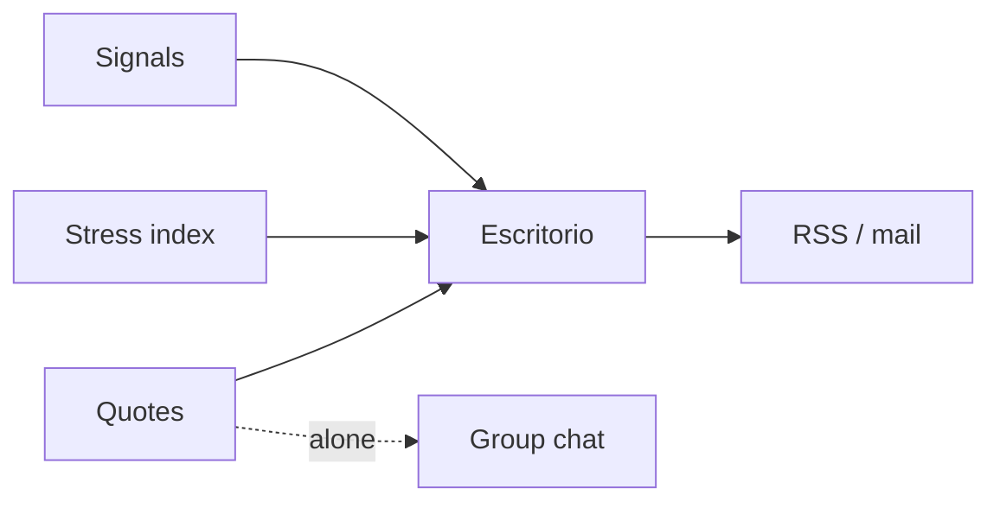

Argentine macro arrives as numbers, screenshots, and group chats. Someone still pastes a quote into a thread and calls it a read.

[DolarGaucho](/work/dolargaucho) is the week's desk — *pulso*. Quotes, a stress index, signals, and a short read. Not a spreadsheet. Not a thread. Live at [dolargaucho.com](https://www.dolargaucho.com).

## The problem

The dollar has many names: official, blue, MEP, CCL. Each is a number. None of them is the week. If you only ship the strip, the person still has to assemble the story by hand. If you only ship the story, they cannot check the strip.

The feed is the same desk: *Pulso Macro*. Public sources. Not financial advice. The bulletin is the desk in email. RSS is the desk in a reader.

## One hard decision

**The quote is not the product.** The product is how fast someone can trust the strip and move on.

A stress index with a word — Estable — sits above the four dollars. Drivers are named: blue, country risk, inflation. Signals are sentences, not a dashboard of forty series. A series published by someone else stays theirs — the Índice Líder is CIF-UTDT, not a DólarGaucho invention.

The number is a UI problem: how it sits next to yesterday, next to the week, next to the reason. Methodology and status are pages. They are not the first screen.

## What I would not do again

Lead with forty charts because the data is there. The week is a desk. A desk has a first sentence.

Treat a public series as yours. Attribution is the product too.

## The bar

A pulse you can finish, and a strip you can check. [dolargaucho.com](https://www.dolargaucho.com) · [RSS](https://www.dolargaucho.com/feed).
