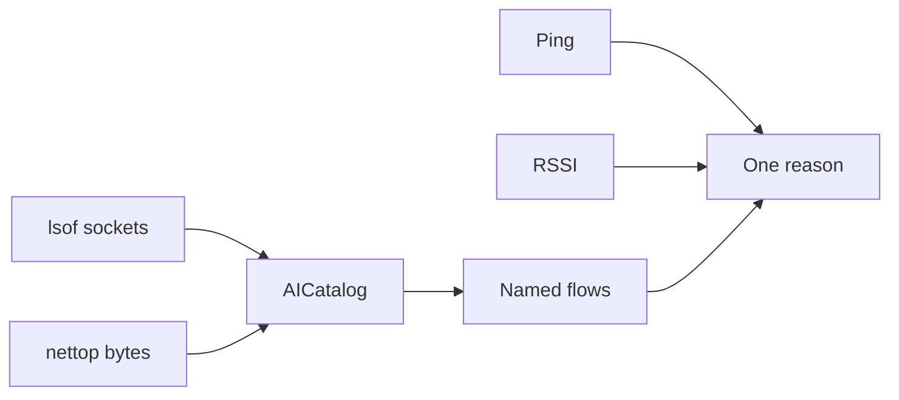

A speed test tells you the pipe is wide. Activity Monitor tells you a process is loud. Neither tells you why the ping moved while Cursor was streaming. RSSI stays Excellent. The reflex is “Wi-Fi died.” The radio is fine. A helper is filling the uplink.

[DevWifiBar](/work/devwifi) is a native Swift menu bar for that moment. Process name. Destination host. Bytes. Ping. RSSI. The payload stays encrypted.

## The problem

If you open the packet to prove which app is loud, you have a different product: a sniffer, a keychain story, a privacy review you will not finish.

`lsof` says who holds a TCP socket. `nettop` says how many bytes moved. Matching `Cursor Helper` or `api.anthropic.com` is a catalog. Matching `evilopenai.com` is a guess you will regret. Chrome talking to `api.openai.com` is OpenAI. Chrome talking to an IP is ignored. Slack is ignored. `node` without a known host is ignored.

The catalog is allow-list process names and hosts. It is not DPI. It is not “anything that looks like an LLM.”

## One hard decision

**Nothing inside TLS.** No payload. No keychain. [`AIBrief.diagnose`](https://github.com/tomymaritano/devwibar/blob/main/Sources/DevWifiCore/AIBrief.swift) is a function you can test: offline, disconnected, quiet, streaming, uplink lag, saturated, live.

Latency is high above 80 ms and clears below 60 ms. Saturate above 2.5 Mbps and clears below 1.6 Mbps. If ping is high and signal is Excellent or Good, the verdict is the host — not RSSI. Three chips. One sentence with the numbers. No slogan rewrite.

The [widget is not a radar](/writing/the-widget-is-not-a-radar): WidgetKit reads a snapshot. It will not run `lsof`. The [bar is not the CLI](/writing/the-bar-is-not-the-cli): `pass`, `qr`, `speed` stay in the toolkit.

## What I would not do again

Decrypt the stream to name the model. The host is enough. The payload is someone else's session.

Put a speed test in the menu bar because the CLI already has one. The bar is the radar. The CLI is the toolkit.

## The bar

A verdict you can read without opening a window. Install: `brew tap tomymaritano/tap && brew install --cask devwibar`. Core: [github.com/tomymaritano/devwibar](https://github.com/tomymaritano/devwibar).
