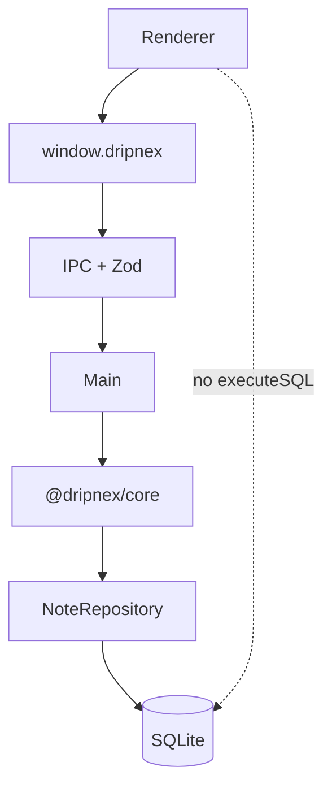

A desktop note app will put SQL next to the editor because it is faster this week. Then the renderer can `require('fs')`. Then a plugin can too. Then the store is whatever the UI happened to type.

[Dripnex](/work/dripnex) keeps a hard line. [ADR-001](https://github.com/dripnex/docs-site/blob/main/content/docs/decisions/adr-001-runtime-contract.mdx) is the runtime contract. The [IPC page](https://github.com/dripnex/docs-site/blob/main/content/docs/architecture/ipc.mdx) is how the processes talk.

What you persist is a different decision, written [elsewhere](/writing/sqlite-is-the-store). What a pack *is* is a different decision too — [one repo, a tarball](/writing/the-plugin-is-a-git-repo). This is the wall between them.

## The problem

If core imports Electron, you cannot test a note without spinning a window. If the renderer speaks SQL, you cannot change the store without changing the editor. If a plugin can `invoke` an IPC channel, you have given it the same keys as the app.

`@dripnex/core` has **zero** Electron, React, or Node-specific APIs. It exposes operations and a repository *interface* — [the write port, not the index](/writing/the-write-port-is-not-the-index). `@dripnex/storage-sqlite` is the adapter. The renderer calls `window.dripnex.notes.create()`. Preload is `contextBridge`. Main validates with Zod, then `createNoteOperation`. There is no `executeSQL`.

Plugins run in the renderer. They are **trusted**, not sandboxed — `new Function()` on `main`. They get `PluginContext`. They do not get IPC. Only load what the user installed.

## One hard decision

**The renderer never sees SQL.** Core is operations. IPC is the contract. Storage is an adapter.

A single package with folders looks simpler. It cannot enforce the boundary at build time. Domain-shaped modules (notes, tags, links) bury the security cut. The cut is the product: the UI cannot reach the disk except through a typed channel.

Sync, auth, and encryption live on the same bridge as namespaces. They are optional. Taking a note does not require them.

## What I would not do again

Let the editor import the database because a list query was awkward. Then every screen is a storage bug.

Give plugins the same `invoke` as the app. `PluginContext` is the permission. IPC is not.

Put domain logic in the React tree so it "stays close to the UI." Then you cannot run it in Node, and you will not.

## The bar

A note you can create without the window, and a window that cannot see the database. ADR-001 in [dripnex/docs-site](https://github.com/dripnex/docs-site/blob/main/content/docs/decisions/adr-001-runtime-contract.mdx). Live at [dripnex.app](https://dripnex.app).
