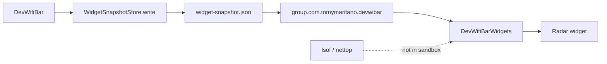

A WidgetKit radar that shells `lsof` looks live. Then the sandbox is a second scanner, and the desktop widget has a privacy review you will not finish. A gallery card that re-diagnoses on every refresh looks honest. Then bar and widget disagree on the host, and *why* is two products.

[DevWifiBar](/work/devwifi) keeps the widget a reader. The [README](https://github.com/tomymaritano/devwibar/blob/main/README.md) is the contract: system widgets refresh about every five minutes. Radar only appears after the app has written a snapshot. **The widget is not a radar.** It will not run `lsof` inside the sandbox.

What fills the pipe is written [elsewhere](/writing/the-radio-is-fine). SSID is [not free](/writing/ssid-is-not-free). This is how the desktop is allowed to show the verdict.

## The problem

If the `.appex` runs `lsof`, you shipped a second radar in a process that cannot hold a TCP catalog. If it samples only CoreWLAN, the widget can say Excellent while the bar says Claude. If you skip the snapshot so "it always looks live," radar is empty until someone opens the popover — and the gallery says Open DevWifiBar.

[`WidgetSnapshot`](https://github.com/tomymaritano/devwibar/blob/main/Sources/DevWifiCore/WidgetSnapshot.swift) is a Codable bag: RSSI, IP, histories, `diagnosisTitle`, `diagnosisReason`, `topApp`, `topAppHost`. The app writes `widget-snapshot.json` into the app group. The extension calls `loadForWidget()`. Fresh is two minutes. Stale keeps radar fields from the file and merges live radio and IP from `WifiReader` / `NetworkReader`. Those readers are not `lsof`.

[`SnapshotProvider`](https://github.com/tomymaritano/devwibar/blob/main/Sources/DevWifiBarWidgets/SharedTimeline.swift) is a timeline of one entry, policy `.after` five minutes. [`RadarWidget`](https://github.com/tomymaritano/devwibar/blob/main/Sources/DevWifiBarWidgets/RadarWidget.swift) prints `topApp` and the reason. No app: "Open DevWifiBar". Empty snapshot reason is the same sentence.

`DevWifiCore` is the readers and the snapshot. `DevWifiBar` is the status item. `DevWifiBarWidgets` is the `.appex`. Three targets. One verdict.

## One hard decision

**The widget is not a radar.** WidgetKit reads a snapshot. Do not run `lsof` in the sandbox. Do not diagnose twice.

If the gallery can name a helper the bar has not seen, it is not this widget.

## What I would not do again

Call `ProcessTrafficReader` from the extension so "the desktop is always current." Then you have two catalogs, and the sandbox is the one you cannot test.

Skip the app group and write into Application Support only. Then Notification Center is empty, and Homebrew users think widgets are broken.

## The bar

A desktop card that names the helper the bar already named, five minutes later, without a second `lsof`. README: [tomymaritano/devwibar](https://github.com/tomymaritano/devwibar). Snapshot: [WidgetSnapshot.swift](https://github.com/tomymaritano/devwibar/blob/main/Sources/DevWifiCore/WidgetSnapshot.swift).
