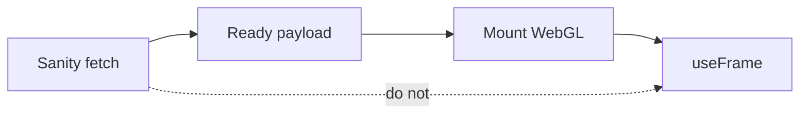

Three.js is imperative. [Sanity](https://www.sanity.io/) is async. A React re-render will kill a WebGL context if you let it. I wanted a 3D surface whose content stayed editable in a CMS. The canvas and the CMS can coexist. They cannot share a render cycle.

## The problem

Fetching inside the scene looks convenient. So does remounting the canvas when a field changes. Both die the same way: the context is gone, the first frame is expensive, and you start inventing loading states that are really remounts.

`@react-three/fiber` does not save you. `useFrame` plus a stale closure will haunt you. Memoize anything that touches the renderer, or do not touch it.

## One hard decision

Keep Three.js in its own component. Isolate it from CMS updates. Fetch all Sanity data **before** the canvas mounts. No async inside the scene. The architecture that stays smooth is usually the less elegant one.

A field change updates the data. It does not remount the canvas. If two trees own the renderer, they will disagree.

## What I would not do again

Put a GROQ query in a `useFrame`. The first time it looks live. The third time you have two clocks.

Let the CMS remount the canvas “to be safe.” Safe is the previous context, still alive.

## The bar

An editable scene that does not die when a title changes. The last mile is still the same: a frame someone can look at — not a dump of the model I call a CMS.
